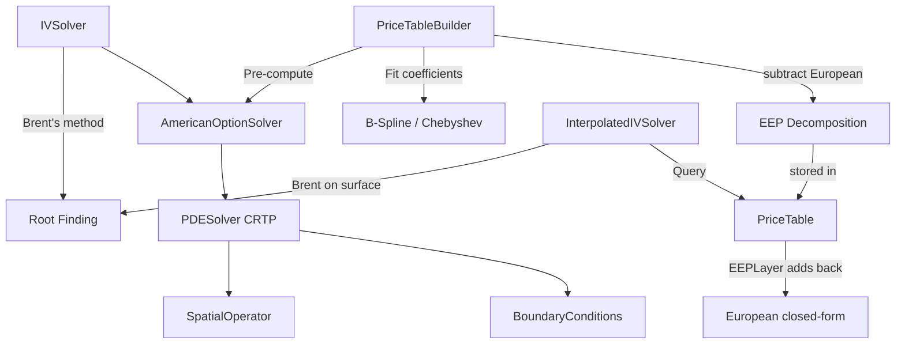
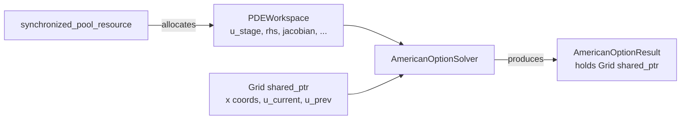
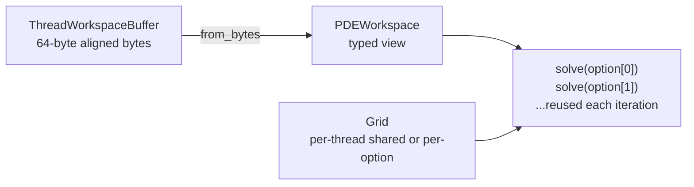
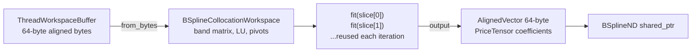

# Software Architecture

How the mango-option library is built, from the PDE solver core up through price tables and batch processing. Each section introduces the C++ patterns and design decisions where they arise, rather than cataloguing them separately.

**Related documents:**
- [Interpolation Framework](INTERPOLATION_FRAMEWORK.md) — Template composition for price surfaces
- [Mathematical Foundations](MATHEMATICAL_FOUNDATIONS.md) — PDE formulations, numerical methods
- [API Guide](API_GUIDE.md) — Usage examples and recipes
- [Performance Analysis](PERF_ANALYSIS.md) — Instruction-level profiling data
- [USDT Tracing](TRACING.md) — Runtime observability

---

## Overview

The library has three computation paths, each targeting a different latency/accuracy tradeoff:

| Path | Latency | Use case |
|------|---------|----------|
| **FDM pricing** | ~0.3ms ATM, ~9-19ms off-ATM | Single option or small batch |
| **FDM-based IV** | ~8ms ATM | Ground-truth implied volatility |
| **Interpolated IV** | ~3.5us/IV | Production queries against pre-computed table |
| **Discrete dividend IV** | ~3.5us/IV | Same interpolated speed, with cash dividend handling |

All three paths share the same PDE solver core. The interpolated path adds a pre-computation step (building a 4D B-spline price table), then replaces the PDE solve at query time with a surface lookup plus Newton iteration. Discrete dividends extend the interpolated path by segmenting the time axis at each dividend date.



The rest of this document walks through these components bottom-up: PDE solver core, American option layer, IV solvers, price tables, memory management, and batch processing.

---

## 1. PDE Solver Core

### CRTP for Zero-Cost Polymorphism

The PDE solver is a CRTP base class. Derived classes supply boundary conditions, a spatial operator, and optionally an obstacle function (for American options). The base class handles time-stepping, Newton iteration, and convergence control.

```cpp
template<typename Derived>
class PDESolver {
public:
    std::expected<void, SolverError> solve() {
        auto& derived = static_cast<Derived&>(*this);
        auto left_bc = derived.left_boundary();
        auto spatial_op = derived.spatial_operator();
        // TR-BDF2 time stepping with Newton iteration...
    }
};
```

Why CRTP instead of virtual functions? The solver's inner loop calls `spatial_operator().apply()` and `obstacle()` at every Newton iteration of every time step. Virtual dispatch would add ~5-10 cycles per call and prevent inlining. CRTP compiles to direct calls with full inlining, which matters when the loop body is only ~50 instructions. The tradeoff is more complex syntax and longer compile times.

A compile-time concept detects whether the derived class provides an analytical Jacobian:

```cpp
template<typename SpatialOp>
concept HasAnalyticalJacobian = requires(const SpatialOp op, double coeff_dt,
                                          TridiagonalMatrixView jac) {
    { op.assemble_jacobian(coeff_dt, jac) } -> std::same_as<void>;
};
```

If the concept is satisfied, the solver uses the analytical Jacobian directly. Otherwise it falls back to finite difference approximation. `BlackScholesPDE` provides an analytical Jacobian; custom PDEs do not need to.

### Grid and Workspace

The solver operates on two objects: a **Grid** (spatial coordinates and solution storage) and a **PDEWorkspace** (temporary buffers for the solve). The Grid is shared-ownership (`std::shared_ptr`) because the result object needs the Grid for interpolation after the solver is destroyed. The workspace is caller-owned so it can be reused across multiple solves. See [Memory Management](#5-memory-management) for how these are allocated.

Grid generation uses a factory pattern with validation:

```cpp
auto spec = GridSpec<double>::sinh_spaced(-3.0, 3.0, 201, 2.0);
// Returns std::expected<GridSpec, std::string>
```

Three grid types: `uniform()`, `sinh_spaced()` (single concentration point), and `multi_sinh_spaced()` (multiple concentration points, useful for barrier options or multi-strike chains).

### Spatial Operators and SIMD

Spatial operators (BlackScholesPDE, LaplacianPDE) compute `L*u` — the spatial discretization applied to the current solution vector. The inner loop is a weighted stencil:

```cpp
[[gnu::target_clones("default", "avx2", "avx512f")]]
void compute_second_derivative(...) {
    #pragma omp simd
    for (size_t i = start; i < end; ++i) {
        d2u_dx2[i] = weights[i].left  * u[i-1]
                   + weights[i].center * u[i]
                   + weights[i].right  * u[i+1];
    }
}
```

The `target_clones` attribute generates SSE2, AVX2, and AVX-512 versions. An IFUNC resolver picks the best one at first call (~500ns overhead, then zero). OpenMP SIMD pragmas guide auto-vectorization.

Why OpenMP SIMD instead of explicit SIMD intrinsics or `std::experimental::simd`? In benchmarks, OpenMP SIMD outperformed explicit SIMD in 9 of 12 cases (often by 15-45%). Modern compilers (GCC 14, Clang 19) are good enough at auto-vectorization that hand-written intrinsics add complexity without payoff for this workload.

The `CenteredDifference` class provides a unified facade for all derivative computations, delegating to a `ScalarBackend` that uses OpenMP SIMD internally. No runtime mode selection — the facade is thin enough for the compiler to inline through.

---

## 2. American Option Layer

### Solver and Result

`AmericanOptionSolver` derives from `PDESolver` and supplies:
- **Left boundary:** Dirichlet BC (intrinsic value for deep ITM)
- **Right boundary:** Dirichlet BC (zero for far OTM)
- **Spatial operator:** `BlackScholesPDE` with the option's vol, rate, and dividend yield
- **Obstacle:** Early exercise constraint (intrinsic value at each node)

The solver returns an `AmericanOptionResult` that wraps the Grid:

```cpp
class AmericanOptionResult {
    std::shared_ptr<const Grid<double>> grid_;
    PricingParams params_;

public:
    double price() const;   // Interpolate at spot
    double delta() const;   // dV/dS via CenteredDifference
    double gamma() const;   // d²V/dS²
    double theta() const;   // dV/dt via backward difference
};
```

Greeks are computed lazily on first access. Delta and gamma use centered finite differences on the spatial grid. Theta uses a backward difference between the last two time steps (stored as snapshots in the Grid).

### Error Handling with std::expected

All public APIs return `std::expected<T, Error>` instead of throwing. Validation chains compose monadically:

```cpp
auto validate_query(const IVQuery& query) const
    -> std::expected<std::monostate, IVError>
{
    return validate_positive_parameters(query)
        .and_then([&](auto) { return validate_arbitrage_bounds(query); })
        .and_then([&](auto) { return validate_grid_params(); });
}
```

Why not exceptions? The solver runs in tight loops (batch pricing, Brent iterations). Exception overhead — stack unwinding setup, code size bloat (~20-30%) — is disproportionate for a numerical library where errors are expected outcomes (e.g., convergence failure is not exceptional, it's a valid result). `std::expected` has zero cost on the success path and makes error handling explicit in the type system.

### Grid Auto-Estimation

`estimate_pde_grid()` selects grid size and time steps based on volatility, maturity, and moneyness. A typical result is 101 spatial points and 498 time steps. This avoids requiring the user to understand numerical parameters while still allowing override for fine-grained control.

---

## 3. Implied Volatility Solvers

### FDM-Based (IVSolver)

The FDM solver wraps Brent's root-finding method around the American option solver. Given a market price, it searches for the volatility that makes the model price match:

```
IVSolver → Brent's method → AmericanOptionSolver (5-8 calls) → price
```

Each Brent iteration solves the PDE from scratch (no warm-starting), so total time is ~5-8 PDE solves. Adaptive volatility bounds narrow the search based on intrinsic value. Typical latency: ~8ms ATM per IV.

**Grid estimation.** Each Brent iteration uses heuristic grid estimation via `GridAccuracyParams`, which scales the grid appropriately for the candidate volatility.

### Interpolated (InterpolatedIVSolver)

The interpolated solver replaces the nested PDE solve with a lookup into a pre-computed price surface. Brent's method on the smooth surface converges in ~4-6 function evaluations, each requiring only a surface evaluation (~250ns). Total IV solve: ~3.5μs — a ~2,000x speedup over FDM.

Before starting the root search, the solver evaluates surface vega at three representative volatilities (10%, 25%, 50%). If all are below a threshold (default 1e-4), the option has near-zero vega sensitivity and IV is effectively undefined — the solver returns `VegaTooSmall` immediately (~600ns) instead of running a doomed search.

This is the production path. You pay a one-time pre-computation cost (see next section), then amortize it over millions of queries.

---

## 4. Price Tables and B-Splines

### Pre-Computation Pipeline

`PriceTableBuilder` constructs a 4D price surface over (moneyness, maturity, volatility, rate). The pipeline:

1. Enumerate grid points across all four dimensions
2. For each (vol, rate) pair, solve the PDE across all maturities and strikes
3. Subtract the closed-form European price to obtain the Early Exercise Premium (EEP)
4. Fit B-spline or Chebyshev interpolant to the EEP values
5. Wrap in a `PriceTable` for fast evaluation (see [Interpolation Framework](INTERPOLATION_FRAMEWORK.md))

### Early Exercise Premium (EEP) Decomposition

The American free boundary creates a C1 discontinuity in the price surface that degrades B-spline interpolation from O(h⁴) to ~O(h^2.5). The builder always uses EEP decomposition, storing the Early Exercise Premium instead of the raw price:

```
EEP(m, τ, σ, r) = P_American(m, τ, σ, r) − P_European(m, τ, σ, r)
```

The EEP surface is smoother (the discontinuity lies in the European component, which is computed exactly at query time), restoring full B-spline convergence. At query time, `PriceTable` reconstructs the full price via the `EEPLayer`:

```
P_American = (K/K_ref) · EEP_interp(x, τ, σ, r) + P_European(S, K, τ, σ, r, q)
```

Greeks follow the same decomposition: each Greek is the sum of the interpolated EEP Greek (computed via chain rule through the coordinate transform) and the closed-form European Greek. Gamma uses analytical B-spline second derivatives (not FD), giving O(h^2) accuracy. For Chebyshev surfaces, gamma falls back to central FD.

The `PriceTable` exposes `delta()`, `gamma()`, `theta()`, and `rho()` alongside `price()` and `vega()`. All Greek methods return `std::expected<double, GreekError>`. An early-exit optimization in `EEPLayer` returns the European Greek directly when the EEP is zero (deep OTM), skipping interpolation derivatives.

**For the full template composition architecture, see [INTERPOLATION_FRAMEWORK.md](INTERPOLATION_FRAMEWORK.md).**

A softplus floor (`log1p(exp(100·x))/100`) enforces non-negativity of the EEP during tensor construction, preventing B-spline ringing near τ→0 where the premium vanishes.

**Accuracy improvement** (grid sweep benchmark, SPY-like parameters):

| Grid | Max IV err (bps) — raw | Max IV err (bps) — EEP |
|------|:----------------------:|:----------------------:|
| 6x6x15x4 | ~20 | 5.0 |
| 10x10x25x6 | ~8 | 2.5 |
| 12x12x30x8 | ~5 | 1.9 |

EEP decomposition is always applied. The type system enforces the correct reconstruction path: standard surfaces use `AnalyticalEEP` (which adds the European component at query time), while segmented leaf surfaces use `IdentityEEP` (raw prices, no reconstruction).

### Multi-Dimensional Indexing with mdspan

B-spline coefficients use `std::mdspan` for type-safe multi-dimensional indexing:

```cpp
mdspan<double, dextents<size_t, 4>> coeffs(data.data(), n_m, n_tau, n_sigma, n_r);
double c = coeffs[i, j, k, l];  // No manual stride calculation
```

This compiles to the same assembly as hand-rolled `data[i*s0 + j*s1 + k*s2 + l]` but eliminates index arithmetic errors.

### Grid Density Profiles

The builder supports automatic grid estimation via `from_grid_auto_profile()` with four density profiles (Low, Medium, High, Ultra). Grid budget is allocated by curvature:

| Dimension | Weight | Rationale |
|-----------|--------|-----------|
| Volatility (sigma) | 1.5x | Highest curvature from vega non-linearity |
| Moneyness (m) | 1.0x | ATM gamma peak handled by log-transform |
| Maturity (tau) | 1.0x | Baseline, sqrt-tau behavior |
| Rate (r) | 0.6x | Nearly linear discounting |

The default (High) targets ~20 bps average IV error. For tighter tolerance, `AdaptiveGridBuilder` iteratively refines grid density until a target error is met — typically achieving <5 bps IV error in the core region (ATM ±30%, T ≥ 0.25).

---

## 5. Discrete Dividend Support

### Problem

Cash dividends break the price homogeneity assumption that underpins the standard moneyness-based price table. A stock paying a $1.50 dividend at t=0.25 has a price discontinuity at that date: S(0.25+) = S(0.25-) - 1.50. The PDE boundary conditions change across the dividend, so a single surface over the full maturity range cannot capture the jump.

### Segmented Approach

The library handles discrete dividends by splitting the time axis at each dividend date and solving backward through each segment. The component hierarchy uses typed template composition:

```
PriceTable< SplitSurface< SplitSurface< TransformLeaf, TauSegmentSplit >,
                           MultiKRefSplit > >
```

Concretely, for B-spline:

```
BSplineMultiKRefSurface = PriceTable<BSplineMultiKRefInner>
  └── SplitSurface<BSplineSegmentedSurface, MultiKRefSplit>  (one per K_ref)
        └── SplitSurface<BSplineSegmentedLeaf, TauSegmentSplit>  (one per tau segment)
              └── TransformLeaf<SharedBSplineInterp<4>, StandardTransform4D>
```

**Backward chaining:** Segments are built from expiry backward. The last segment (dividend-free) solves the standard American PDE. Earlier segments use the next segment's price as their initial condition (after adjusting spot for the dividend drop). This propagates the dividend effect through the full maturity range.

**Multi-K_ref:** With continuous dividends, American option prices are homogeneous in strike: P(S, K) = K * f(S/K). Cash dividends break this property because the dividend amount is absolute, not proportional. To maintain interpolation accuracy, multiple reference strikes (K_ref) are used. Each K_ref produces a separate segmented surface, and queries interpolate across K_ref values weighted by proximity to the actual strike.

### EEP vs Raw Price by Segment

- **Last segment** (no dividend boundary): Uses EEP decomposition, same as the standard path. The European component can be computed analytically.
- **Earlier segments**: Store raw prices. The initial condition comes from the next segment's surface evaluation (not from a closed-form expression), so no clean European decomposition exists.

### Type Erasure

`InterpolatedIVSolver<Surface>` is templated on the concrete surface type, preserving full inlining within each instantiation. The factory returns `AnyInterpIVSolver`, which type-erases via a `std::variant` of all 6 solver instantiations (B-spline 4D, B-spline segmented, Chebyshev 4D, Chebyshev segmented, B-spline 3D, Chebyshev 3D). `std::visit` dispatches at the solve boundary, keeping the hot path (surface evaluation) monomorphic.

The `make_interpolated_iv_solver` factory selects the appropriate type based on the `backend` variant and `discrete_dividends` option. See [INTERPOLATION_FRAMEWORK.md](INTERPOLATION_FRAMEWORK.md) for the full dispatch tree.

---

## 6. Memory Management

The library uses three allocation strategies, each suited to a different lifetime and alignment requirement. The diagrams below show how they apply to each workload.

### Single Option Solve

The caller creates a PMR pool and a Grid. The pool backs the PDEWorkspace (scratch buffers for the solve — solution stages, RHS vector, Newton arrays). The Grid holds the spatial coordinates and solution vectors. After the solve, the result holds a `shared_ptr` to the Grid so it can interpolate prices and compute Greeks.



The workspace totals ~13n doubles for a grid of n points, padded to 8-element boundaries for AVX-512. Why PMR instead of raw `new`? Repeated solves would otherwise allocate and deallocate the same ~10KB of buffers thousands of times. PMR lets the caller control lifetime: allocate once, reuse across solves, release when done.

### Batch Pricing

Each OpenMP thread gets a `ThreadWorkspaceBuffer` — a 64-byte-aligned byte slab allocated once at thread creation. A `PDEWorkspace` is constructed as a typed view over this slab via `from_bytes()`. The thread also gets a `Grid`, which in shared-grid mode (options differ only in strike) is reused across all options on that thread. In independent mode, a new Grid is created per option.



### Price Table Build

Same `ThreadWorkspaceBuffer` pattern, but the typed view is a `BSplineCollocationWorkspace` (band matrix, LU workspace, pivot indices) instead of a PDEWorkspace. Each thread fits hundreds of 1D spline slices, reusing the same workspace each time. The output — the fitted tensor of B-spline coefficients — is stored in an `AlignedVector` with 64-byte alignment for AVX-512.



### Why Three Strategies?

| Strategy | Used by | Why not the others? |
|----------|---------|-----|
| **PMR pool** | PDEWorkspace (single solve) | Caller controls lifetime; zero allocation during solve; reusable across solves |
| **ThreadWorkspaceBuffer** | PDEWorkspace and BSplineCollocationWorkspace (parallel loops) | One slab per thread, reused for every work item. Reduces allocations from O(work items) to O(threads). Uses C++23 `std::start_lifetime_as_array` for strict-aliasing compliance. Falls back to PMR if buffer too small |
| **AlignedVector** | PriceTensor (persistent output) | Outlives the solver. Needs 64-byte alignment for AVX-512; PMR only guarantees 16 bytes |

`ThreadWorkspaceBuffer` is not a workspace — it is the raw byte slab that typed workspaces are built on top of. In batch pricing, a `PDEWorkspace` is constructed over it. In price table construction, a `BSplineCollocationWorkspace` is constructed over it instead. Same allocation pattern, different typed view.

---

## 7. Batch Processing and Parallelism

With memory management covered above, the batch processing layer is straightforward. The solver distributes options across OpenMP threads, each with its own pre-allocated workspace and (optionally) shared Grid:

```cpp
MANGO_PRAGMA_PARALLEL
{
    ThreadWorkspaceBuffer buffer(required_bytes);
    auto ws = PDEWorkspace::from_bytes(buffer.bytes(), n).value();

    MANGO_PRAGMA_FOR_STATIC
    for (size_t i = 0; i < count; ++i) {
        solver.solve_with_workspace(params[i], ws);
    }
}
```

### Shared-Grid Optimization

When pricing a chain of options that differ only in strike (same vol, rate, maturity), the solver can share a single Grid per thread. This avoids re-generating spatial coordinates and re-computing grid-dependent quantities, giving ~10x speedup for a 15-option chain.

### Price Table Parallelism

Price table construction parallelizes along two axes: PDE solves (one per (vol, rate) pair) and B-spline fitting (one per 1D slice). Both use the same `ThreadWorkspaceBuffer` pattern with the appropriate typed workspace.

---

## Summary of C++23 Features

For reference, here are the C++23 features used and where they appear:

| Feature | Where | Purpose |
|---------|-------|---------|
| `std::expected<T, E>` | All public APIs | Type-safe error handling without exceptions |
| Concepts | PDESolver | Compile-time detection of analytical Jacobian |
| `std::mdspan` | B-spline coefficients | Type-safe multi-dimensional indexing |
| `std::start_lifetime_as_array` | ThreadWorkspaceBuffer | Strict-aliasing compliance for byte-buffer reuse |
| PMR (`std::pmr::vector`) | PDEWorkspace | Arena allocation for solver buffers |
| CRTP | PDESolver | Zero-cost polymorphism for spatial operators |
| `[[gnu::target_clones]]` | CenteredDifference | Multi-ISA code generation (SSE2/AVX2/AVX-512) |
| Designated initializers | Option params, grid specs | Readable struct construction |

---

## Related Documents

- [Interpolation Framework](INTERPOLATION_FRAMEWORK.md) — Template composition for price surfaces
- [Mathematical Foundations](MATHEMATICAL_FOUNDATIONS.md) — PDE formulations and numerical methods
- [API Guide](API_GUIDE.md) — Usage examples and recipes
- [Performance Analysis](PERF_ANALYSIS.md) — Instruction-level profiling
- [USDT Tracing](TRACING.md) — Runtime observability
