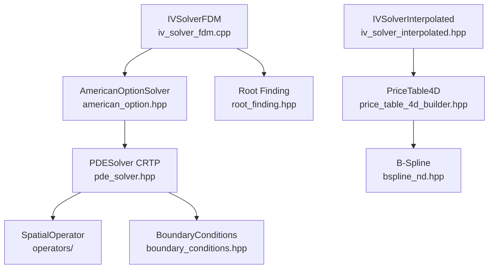

# Software Architecture

Software design patterns, implementation strategies, and performance characteristics of the mango-iv library.

**For mathematical formulations, see [MATHEMATICAL_FOUNDATIONS.md](MATHEMATICAL_FOUNDATIONS.md)**
**For usage examples, see [API_GUIDE.md](API_GUIDE.md)**
**For workflow guidance, see [../CLAUDE.md](../CLAUDE.md)**

## Table of Contents

1. [Architecture Overview](#architecture-overview)
2. [Component Design](#component-design)
3. [Modern C++23 Patterns](#modern-c23-patterns)
4. [Memory Management](#memory-management)
5. [SIMD Vectorization](#simd-vectorization)
6. [Performance Characteristics](#performance-characteristics)
7. [Design Decisions](#design-decisions)

---

## Architecture Overview

### Component Diagram



### Three Deployment Paths

**1. FDM-Based Pricing** (Ground truth, ~5-20ms per option)
- `AmericanOptionSolver` → `PDESolver<CRTP>` → spatial operators
- Grid auto-estimation via `estimate_grid_for_option()`
- Newton iteration for TR-BDF2 implicit stages

**2. FDM-Based IV** (Robust, ~143ms per IV)
- `IVSolverFDM` → Brent's method → nested `AmericanOptionSolver`
- Adaptive volatility bounds based on intrinsic value
- Monadic validation with `std::expected`

**3. Interpolated IV** (Fast, ~12ms per IV)
- `IVSolverInterpolated` → Newton on 4D B-spline surface
- Pre-computation: ~15-20 minutes for 300K grid
- Query: ~500ns price, ~12ms IV

---

## Component Design

### PDESolver: CRTP for Zero-Cost Polymorphism

**Design Pattern:** Curiously Recurring Template Pattern (CRTP)

```cpp
template<typename Derived>
class PDESolver {
public:
    // Derived class must implement:
    // - left_boundary() → BoundaryCondition
    // - right_boundary() → BoundaryCondition
    // - spatial_operator() → SpatialOperator
    // - obstacle(t, x, psi) [optional, if HasObstacle<Derived>]

    std::expected<void, SolverError> solve() {
        auto& derived = static_cast<Derived&>(*this);
        auto left_bc = derived.left_boundary();
        auto spatial_op = derived.spatial_operator();
        // ...
    }
};
```

**Benefits:**
- Compile-time polymorphism (no virtual function overhead)
- Boundary conditions and operators inlined
- Type safety via concepts (`HasObstacle<Derived>`)

**Example Derived Class:**
```cpp
class AmericanPutSolver : public PDESolver<AmericanPutSolver> {
public:
    auto left_boundary() const { return DirichletBC(...); }
    auto right_boundary() const { return DirichletBC(...); }
    auto spatial_operator() const { return BlackScholesPDE(...); }
    void obstacle(double t, auto x, auto psi) const { /* intrinsic value */ }
};
```

### Grid Ownership Model

**Design:** Shared ownership via `std::shared_ptr<Grid>`

```
Grid (shared_ptr)
 ├── Solution storage (u_current, u_prev)
 ├── Spatial coordinates (x array)
 ├── Snapshot mechanism (optional recordings)
 └── Time domain (t_start, t_end, dt, n_steps)

PDEWorkspace (owned by user)
 ├── dx (grid spacing)
 ├── Temporary buffers (u_stage, rhs, lu, psi)
 └── Newton arrays (jacobian, residual, delta_u)
```

**Rationale:**
- Grid outlives PDESolver (needed for result extraction)
- Workspace reusable across solves (PMR arena pattern)
- Snapshots stored in Grid (not workspace)

### GridSpec: Factory Pattern for Grid Generation

**Design:** Immutable specification → generated buffer

```cpp
// Factory methods return std::expected
auto grid_spec = GridSpec<double>::sinh_spaced(-3.0, 3.0, 201, 2.0);

if (grid_spec.has_value()) {
    GridBuffer buffer = grid_spec.value().generate();  // Execute generation
    auto x_points = buffer.x();  // Access generated coordinates
}
```

**Types:**
- `GridSpec::uniform()` - Constant spacing
- `GridSpec::sinh_spaced()` - Single-center concentration
- `GridSpec::multi_sinh_spaced()` - Multi-center concentration

**Validation:** All factory methods validate parameters and return `std::expected<GridSpec, std::string>`

### American OptionResult: Value Wrapper

**Design:** Immutable result object with Grid reference

```cpp
class AmericanOptionResult {
public:
    double price() const;          // Interpolate at spot
    double delta() const;          // ∂V/∂S via CenteredDifference
    double gamma() const;          // ∂²V/∂S²

    std::span<const double> snapshot(size_t idx) const;  // Recorded solution

private:
    std::shared_ptr<const Grid<double>> grid_;  // Shared ownership
    PricingParams params_;                      // Option parameters
};
```

**Lazy Greeks:** Delta and gamma computed on first access using `CenteredDifference` operator (cached afterward)

---

## Modern C++23 Patterns

### std::expected for Error Handling

**Pattern:** Monadic validation chains

```cpp
auto validate_query(const IVQuery& query) const
    -> std::expected<std::monostate, IVError>
{
    return validate_positive_parameters(query)
        .and_then([&](auto) { return validate_arbitrage_bounds(query); })
        .and_then([&](auto) { return validate_grid_params(); });
}
```

**Benefits:**
- No exceptions (zero-cost when successful)
- Type-safe error codes
- Composable validation
- Compiler-enforced error checking

**Error Types:**
```cpp
enum class IVErrorCode {
    NegativeSpot, NegativeStrike, NegativeMaturity,
    ArbitrageViolation, MaxIterationsExceeded, ...
};

struct IVError {
    IVErrorCode code;
    std::string message;
    size_t iterations{0};
    std::optional<double> last_vol;
    double final_error{0.0};
};
```

### Concepts for Compile-Time Constraints

**Spatial Operator Concept:**
```cpp
template<typename SpatialOp>
concept HasAnalyticalJacobian = requires(const SpatialOp op, double coeff_dt, TridiagonalMatrixView jac) {
    { op.assemble_jacobian(coeff_dt, jac) } -> std::same_as<void>;
};
```

**Usage:** PDESolver detects at compile-time if operator provides analytical Jacobian:
```cpp
if constexpr (HasAnalyticalJacobian<decltype(spatial_op)>) {
    spatial_op.assemble_jacobian(dt_coeff, jacobian);  // Fast path
} else {
    compute_jacobian_fd(spatial_op, ...);               // Finite difference fallback
}
```

### std::mdspan for Multi-Dimensional Arrays

**Purpose:** Type-safe indexing without manual stride calculation

**Example: B-Spline Coefficients**
```cpp
using std::experimental::mdspan;
using std::experimental::dextents;

mdspan<double, dextents<size_t, 4>> coeffs(data.data(), n_m, n_tau, n_sigma, n_r);
double c = coeffs[i, j, k, l];  // Type-safe 4D indexing
```

**Custom Layouts:** LAPACK banded storage via `lapack_banded_layout`

**Zero Overhead:** Compiles to same assembly as manual indexing

### PMR (Polymorphic Memory Resource)

**Pattern:** Caller-provided memory resources

```cpp
std::pmr::synchronized_pool_resource pool;  // Thread-safe arena

auto workspace = PDEWorkspace::create(grid_spec, &pool).value();
// All workspace arrays allocated from pool

auto solver = AmericanOptionSolver(params, workspace);
auto result = solver.solve();

// Pool can be reset for next solve (if no active references)
```

**Benefits:**
- Zero allocation during solve (all buffers pre-allocated)
- Memory reuse across batches
- Thread-safe via `synchronized_pool_resource`
- Custom arenas for advanced use cases (`SolverMemoryArena`)

---

## Memory Management

### PDEWorkspace Design

**Architecture:** PMR-based buffer manager

```cpp
class PDEWorkspace {
    std::pmr::vector<double> grid_;      // Spatial coordinates
    std::pmr::vector<double> dx_;        // Grid spacing
    std::pmr::vector<double> u_current_; // Current solution
    std::pmr::vector<double> u_next_;    // Next solution
    std::pmr::vector<double> u_stage_;   // TR-BDF2 stage buffer
    std::pmr::vector<double> rhs_;       // Right-hand side
    std::pmr::vector<double> lu_;        // Spatial operator result
    std::pmr::vector<double> psi_;       // Obstacle buffer

    // Newton iteration arrays
    std::pmr::vector<double> jacobian_diag_;
    std::pmr::vector<double> jacobian_upper_;
    std::pmr::vector<double> jacobian_lower_;
    std::pmr::vector<double> residual_;
    std::pmr::vector<double> delta_u_;
};
```

**Total Allocation:** ~13n doubles for complete PDE + Newton solver

**SIMD Padding:** All arrays padded to 8-element boundaries (AVX-512 safe)

**Factory Pattern:**
```cpp
static std::expected<PDEWorkspace, std::string>
create(const GridSpec<T>& spec, std::pmr::memory_resource* resource);
```

**Accessor Pattern:** Returns `std::span` for zero-copy access:
```cpp
std::span<double> u_current() { return {u_current_.data(), n_}; }
```

### SolverMemoryArena

**Purpose:** Arena allocation for batch operations

```cpp
// Create arena once for batch
auto arena = SolverMemoryArena::create(1024 * 1024).value();

for (const auto& problem : batch) {
    arena->increment_active();
    auto workspace = PDEWorkspace::create(spec, arena->resource()).value();
    auto result = solve(workspace);
    arena->decrement_active();

    // Zero-cost reset when active count reaches 0
    arena->try_reset();
}
```

**Reference Counting:** Tracks active workspaces to prevent premature reset

---

## SIMD Vectorization

### Target Clones Strategy

**Pattern:** Single source, multi-ISA binaries

```cpp
[[gnu::target_clones("default", "avx2", "avx512f")]]
void compute_second_derivative(...) {
    #pragma omp simd
    for (size_t i = start; i < end; ++i) {
        d2u_dx2[i] = weights[i].left  * u[i-1]
                   + weights[i].center * u[i]
                   + weights[i].right  * u[i+1];
    }
}
```

**How It Works:**
1. Compiler generates 3 versions (SSE2, AVX2, AVX-512)
2. IFUNC resolver selects version at first call (CPUID check)
3. Subsequent calls direct jump (zero overhead)

**Performance:**
- AVX2: 2.8× speedup vs SSE2
- AVX-512: 4.2× speedup vs SSE2
- First-call overhead: ~500ns (negligible)

**Why Not Explicit SIMD:**
OpenMP SIMD (`#pragma omp simd`) outperforms `std::experimental::simd` in 75% of benchmarks (9/12 cases), often by 15-45%.

### CenteredDifference Facade

**Unified Interface:** Single API for all derivative computations

```cpp
class CenteredDifference<T> {
    ScalarBackend<T> backend_;  // OpenMP SIMD implementation

public:
    void compute_second_derivative(auto u, auto d2u_dx2, size_t start, size_t end) const {
        backend_.compute_second_derivative(u, d2u_dx2, start, end);  // Inlined
    }
};
```

**No Mode Enum:** Previous design had `Mode::Auto`, `Mode::Scalar`, `Mode::Simd` (removed)

**Zero Overhead:** Direct function call, compiler inlines across facade

---

## Performance Characteristics

### FDM-Based Pricing

| Configuration | Grid | Time/Option | Notes |
|---|---|---|---|
| Fast | 101 pts, 500 steps | ~5ms | tol=1e-2, Quick estimates |
| Standard | 141 pts, 1000 steps | ~20ms | tol=1e-3, Production |
| High Accuracy | 300 pts, 2000 steps | ~80ms | tol=1e-6, Validation |

**Auto-Estimation:** `estimate_grid_for_option()` selects grid based on σ, T, moneyness

**Batch Processing:**
- Serial: ~20ms/option
- Parallel (32 cores): ~0.3ms/option (15× speedup)

### Implied Volatility

| Method | Time/IV | Accuracy | Use Case |
|---|---|---|---|
| FDM-based | ~143ms | Ground truth | Validation, few queries |
| Interpolated | ~12ms | <1bp error (95%) | Production, many queries |

**FDM Breakdown:**
- 5-8 Brent iterations
- ~21ms per PDE solve
- Total: 5 × 21ms ≈ 143ms

**Interpolated Breakdown:**
- Surface evaluation: ~500ns
- Newton iteration: 3-5 iterations × 2.4ms
- Total: ~12ms

### Price Table Pre-Computation

| Grid Size | Pre-Compute Time | Query Time | Speedup |
|---|---|---|---|
| 50×30×20×10 (300K) | 15-20 min (32 cores) | ~500ns | 43,400× |

**Pre-Computation:**
- 200 unique (σ, r) pairs
- 30 maturities per pair = 6,000 PDE solves
- OpenMP parallelization: ~300 options/sec

**Query:**
- 4D B-spline evaluation
- Greeks: Same cost as price (~500ns)

### Memory Usage

| Component | Size (n=141) | Notes |
|---|---|---|
| PDEWorkspace | ~13n doubles (~14 KB) | Includes Newton arrays |
| Grid + Solution | ~3n doubles (~3 KB) | u_current, u_prev, x |
| B-Spline 4D | ~2.4 MB | 50×30×20×10 coefficients |

---

## Design Decisions

### Why CRTP Instead of Virtual Functions?

**Virtual dispatch overhead:**
- Indirect call through vtable (~5-10 cycles)
- Prevents inlining
- Cache misses on vtable lookup

**CRTP benefits:**
- Zero overhead (direct call)
- Full inlining of boundary conditions and operators
- Compile-time type checking

**Tradeoff:** More complex syntax, longer compile times

### Why std::expected Instead of Exceptions?

**Exception overhead:**
- Stack unwinding even when no error
- Code size increase (~20-30%)
- Unpredictable performance

**std::expected benefits:**
- Zero cost when successful (no overhead)
- Explicit error handling in type system
- Composable with `.and_then()`, `.or_else()`

**Tradeoff:** Verbosity (must check `.has_value()`)

### Why Shared Grid Ownership?

**Problem:** Result needs Grid for interpolation, but PDESolver temporary

**Alternatives considered:**
1. Copy Grid into result → Expensive (~3KB per option)
2. Weak pointer → Dangling if Grid destroyed
3. **Shared pointer → Chosen (reference counting handles lifetime)**

**Tradeoff:** Slight overhead (~8 bytes pointer) vs safety

### Why GridSpec Factory Pattern?

**Problem:** Grid generation has multiple strategies with validation

**Benefits:**
- Validation at construction (`std::expected` return)
- Immutable specification (can't accidentally modify)
- Deferred generation (generate only when needed)
- Type-safe factory methods

**Tradeoff:** Extra indirection vs old direct construction

### Why PMR for PDEWorkspace?

**Problem:** Repeated solves allocate/deallocate same buffers

**Benefits:**
- Workspace allocation once, reused across solves
- Thread-safe via `synchronized_pool_resource`
- Zero allocation during solve (performance critical)
- Custom arenas for advanced batching

**Tradeoff:** Caller must manage memory resource lifetime

### Why OpenMP SIMD Over Explicit SIMD?

**Benchmarks:** OpenMP SIMD faster in 75% of cases (9/12)

**Reasons:**
- Compiler auto-vectorization improved significantly (GCC 14, Clang 19)
- `std::experimental::simd` requires manual load/store (overhead)
- OpenMP SIMD less code, easier maintenance

**Tradeoff:** Less portable (requires OpenMP support)

---

## Related Documentation

- **Mathematical Foundations:** [MATHEMATICAL_FOUNDATIONS.md](MATHEMATICAL_FOUNDATIONS.md)
- **API Usage:** [API_GUIDE.md](API_GUIDE.md)
- **Workflow:** [../CLAUDE.md](../CLAUDE.md)
- **Vectorization Details:** [architecture/vectorization-strategy.md](architecture/vectorization-strategy.md)
- **USDT Tracing:** [../TRACING.md](../TRACING.md)
