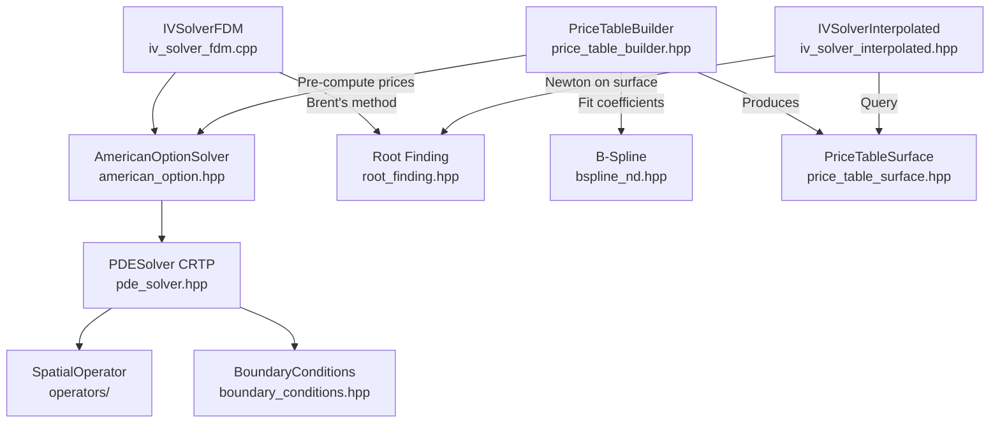

# Software Architecture

Software design patterns, implementation strategies, and performance characteristics of the mango-option library.

**For mathematical formulations, see [MATHEMATICAL_FOUNDATIONS.md](MATHEMATICAL_FOUNDATIONS.md)**
**For usage examples, see [API_GUIDE.md](API_GUIDE.md)**
**For workflow guidance, see [../CLAUDE.md](../CLAUDE.md)**

## Table of Contents

1. [Architecture Overview](#architecture-overview)
2. [Component Design](#component-design)
3. [Modern C++23 Patterns](#modern-c23-patterns)
4. [Memory Management](#memory-management)
5. [SIMD Vectorization](#simd-vectorization)
6. [Performance Characteristics](#performance-characteristics)
7. [Design Decisions](#design-decisions)

---

## Architecture Overview

### Component Diagram



### Three Deployment Paths

**1. FDM-Based Pricing** (Ground truth, ~1.3ms per option)
- `AmericanOptionSolver` → `PDESolver<CRTP>` → spatial operators
- Grid auto-estimation via `estimate_grid_for_option()` (101×498 typical)
- Newton iteration for TR-BDF2 implicit stages

**2. FDM-Based IV** (Robust, ~15ms per IV on 101×1k grid)
- `IVSolverFDM` → Brent's method → nested `AmericanOptionSolver`
- Adaptive volatility bounds based on intrinsic value
- Monadic validation with `std::expected`
- Higher accuracy: ~61ms per IV on 201×2k grid

**3. Interpolated IV** (Fast, ~2.1µs per IV)
- `IVSolverInterpolated` → Newton on 4D B-spline surface
- Pre-computation: ~15-20 minutes for 300K grid
- Query: ~193ns price interpolation, ~2.1µs IV solve
- **7,000× speedup** over FDM-based IV

---

## Component Design

### PDESolver: CRTP for Zero-Cost Polymorphism

**Design Pattern:** Curiously Recurring Template Pattern (CRTP)

```cpp
template<typename Derived>
class PDESolver {
public:
    // Derived class must implement:
    // - left_boundary() → BoundaryCondition
    // - right_boundary() → BoundaryCondition
    // - spatial_operator() → SpatialOperator
    // - obstacle(t, x, psi) [optional, if HasObstacle<Derived>]

    std::expected<void, SolverError> solve() {
        auto& derived = static_cast<Derived&>(*this);
        auto left_bc = derived.left_boundary();
        auto spatial_op = derived.spatial_operator();
        // ...
    }
};
```

**Benefits:**
- Compile-time polymorphism (no virtual function overhead)
- Boundary conditions and operators inlined
- Type safety via concepts (`HasObstacle<Derived>`)

**Example Derived Class:**
```cpp
class AmericanPutSolver : public PDESolver<AmericanPutSolver> {
public:
    auto left_boundary() const { return DirichletBC(...); }
    auto right_boundary() const { return DirichletBC(...); }
    auto spatial_operator() const { return BlackScholesPDE(...); }
    void obstacle(double t, auto x, auto psi) const { /* intrinsic value */ }
};
```

### Grid Ownership Model

**Design:** Shared ownership via `std::shared_ptr<Grid>`

```
Grid (shared_ptr)
 ├── Solution storage (u_current, u_prev)
 ├── Spatial coordinates (x array)
 ├── Snapshot mechanism (optional recordings)
 └── Time domain (t_start, t_end, dt, n_steps)

PDEWorkspace (owned by user)
 ├── dx (grid spacing)
 ├── Temporary buffers (u_stage, rhs, lu, psi)
 └── Newton arrays (jacobian, residual, delta_u)
```

**Rationale:**
- Grid outlives PDESolver (needed for result extraction)
- Workspace reusable across solves (PMR arena pattern)
- Snapshots stored in Grid (not workspace)

### GridSpec: Factory Pattern for Grid Generation

**Design:** Immutable specification → generated buffer

```cpp
// Factory methods return std::expected
auto grid_spec = GridSpec<double>::sinh_spaced(-3.0, 3.0, 201, 2.0);

if (grid_spec.has_value()) {
    GridBuffer buffer = grid_spec.value().generate();  // Execute generation
    auto x_points = buffer.x();  // Access generated coordinates
}
```

**Types:**
- `GridSpec::uniform()` - Constant spacing
- `GridSpec::sinh_spaced()` - Single-center concentration
- `GridSpec::multi_sinh_spaced()` - Multi-center concentration

**Validation:** All factory methods validate parameters and return `std::expected<GridSpec, std::string>`

### American OptionResult: Value Wrapper

**Design:** Immutable result object with Grid reference

```cpp
class AmericanOptionResult {
public:
    double price() const;          // Interpolate at spot
    double delta() const;          // ∂V/∂S via CenteredDifference
    double gamma() const;          // ∂²V/∂S²
    double theta() const;          // ∂V/∂t via backward difference

    std::span<const double> snapshot(size_t idx) const;  // Recorded solution

private:
    std::shared_ptr<const Grid<double>> grid_;  // Shared ownership
    PricingParams params_;                      // Option parameters
};
```

**Lazy Greeks:** Delta, gamma, and theta computed on first access (cached afterward):
- Delta/gamma: `CenteredDifference` spatial derivatives
- Theta: Backward difference `(V_prev - V_current) / dt` from stored snapshots

---

## Modern C++23 Patterns

### std::expected for Error Handling

**Pattern:** Monadic validation chains

```cpp
auto validate_query(const IVQuery& query) const
    -> std::expected<std::monostate, IVError>
{
    return validate_positive_parameters(query)
        .and_then([&](auto) { return validate_arbitrage_bounds(query); })
        .and_then([&](auto) { return validate_grid_params(); });
}
```

**Benefits:**
- No exceptions (zero-cost when successful)
- Type-safe error codes
- Composable validation
- Compiler-enforced error checking

**Error Types:**
```cpp
enum class IVErrorCode {
    NegativeSpot, NegativeStrike, NegativeMaturity,
    ArbitrageViolation, MaxIterationsExceeded, ...
};

struct IVError {
    IVErrorCode code;
    std::string message;
    size_t iterations{0};
    std::optional<double> last_vol;
    double final_error{0.0};
};
```

### Concepts for Compile-Time Constraints

**Spatial Operator Concept:**
```cpp
template<typename SpatialOp>
concept HasAnalyticalJacobian = requires(const SpatialOp op, double coeff_dt, TridiagonalMatrixView jac) {
    { op.assemble_jacobian(coeff_dt, jac) } -> std::same_as<void>;
};
```

**Usage:** PDESolver detects at compile-time if operator provides analytical Jacobian:
```cpp
if constexpr (HasAnalyticalJacobian<decltype(spatial_op)>) {
    spatial_op.assemble_jacobian(dt_coeff, jacobian);  // Fast path
} else {
    compute_jacobian_fd(spatial_op, ...);               // Finite difference fallback
}
```

### std::mdspan for Multi-Dimensional Arrays

**Purpose:** Type-safe indexing without manual stride calculation

**Example: B-Spline Coefficients**
```cpp
using std::experimental::mdspan;
using std::experimental::dextents;

mdspan<double, dextents<size_t, 4>> coeffs(data.data(), n_m, n_tau, n_sigma, n_r);
double c = coeffs[i, j, k, l];  // Type-safe 4D indexing
```

**Custom Layouts:** LAPACK banded storage via `lapack_banded_layout`

**Zero Overhead:** Compiles to same assembly as manual indexing

### PMR (Polymorphic Memory Resource)

**Pattern:** Caller-provided memory resources

```cpp
std::pmr::synchronized_pool_resource pool;  // Thread-safe arena

auto workspace = PDEWorkspace::create(grid_spec, &pool).value();
// All workspace arrays allocated from pool

auto solver = AmericanOptionSolver(params, workspace);
auto result = solver.solve();

// Pool can be reset for next solve (if no active references)
```

**Benefits:**
- Zero allocation during solve (all buffers pre-allocated)
- Memory reuse across batches
- Thread-safe via `synchronized_pool_resource`

**Note:** For parallel workloads, prefer `ThreadWorkspaceBuffer` which provides 64-byte alignment and C++23 lifetime semantics. See [Memory Management](#memory-management).

---

## Memory Management

### PDEWorkspace Design

**Architecture:** PMR-based buffer manager

```cpp
class PDEWorkspace {
    std::pmr::vector<double> grid_;      // Spatial coordinates
    std::pmr::vector<double> dx_;        // Grid spacing
    std::pmr::vector<double> u_current_; // Current solution
    std::pmr::vector<double> u_next_;    // Next solution
    std::pmr::vector<double> u_stage_;   // TR-BDF2 stage buffer
    std::pmr::vector<double> rhs_;       // Right-hand side
    std::pmr::vector<double> lu_;        // Spatial operator result
    std::pmr::vector<double> psi_;       // Obstacle buffer

    // Newton iteration arrays
    std::pmr::vector<double> jacobian_diag_;
    std::pmr::vector<double> jacobian_upper_;
    std::pmr::vector<double> jacobian_lower_;
    std::pmr::vector<double> residual_;
    std::pmr::vector<double> delta_u_;
};
```

**Total Allocation:** ~13n doubles for complete PDE + Newton solver

**SIMD Padding:** All arrays padded to 8-element boundaries (AVX-512 safe)

**Factory Pattern:**
```cpp
static std::expected<PDEWorkspace, std::string>
create(const GridSpec<T>& spec, std::pmr::memory_resource* resource);
```

**Accessor Pattern:** Returns `std::span` for zero-copy access:
```cpp
std::span<double> u_current() { return {u_current_.data(), n_}; }
```

### ThreadWorkspaceBuffer

**Purpose:** Per-thread byte buffer for zero-allocation parallel workloads

```cpp
MANGO_PRAGMA_PARALLEL
{
    // Allocate once per thread (64-byte aligned for AVX-512)
    ThreadWorkspaceBuffer buffer(BSplineCollocationWorkspace<double>::required_bytes(n));

    // Create workspace once per thread (starts object lifetimes)
    auto ws = BSplineCollocationWorkspace<double>::from_bytes(buffer.bytes(), n).value();

    MANGO_PRAGMA_FOR_STATIC
    for (size_t i = 0; i < count; ++i) {
        // Reuse workspace - solver overwrites arrays each iteration
        solver.fit_with_workspace(values[i], ws, config);
    }
}
```

**Key Features:**
- 64-byte aligned storage via `std::aligned_alloc`
- PMR fallback (`unsynchronized_pool_resource`) if buffer exhausted
- C++23 `std::start_lifetime_as_array` for strict-aliasing compliance
- Reduces B-spline fitting allocations from 24,000 to N (thread count)

**Workspace Types:**
- `BSplineCollocationWorkspace<T>` - B-spline fitting (band matrix, LU workspace, pivots)
- `AmericanPDEWorkspace` - PDE solver (byte-buffer wrapper around PDEWorkspace)

### AlignedVector for Persistent Output

**Purpose:** 64-byte aligned `std::vector` for SIMD-optimized persistent storage

```cpp
// Used by PriceTensor and Grid for output buffers
template<typename T, size_t Alignment = 64>
using AlignedVector = std::vector<T, AlignedAllocator<T, Alignment>>;
```

**Usage in PriceTensor:**
```cpp
auto tensor = PriceTensor<4>::create({20, 30, 20, 10});  // ~480K doubles
// Storage is 64-byte aligned for AVX-512 loads/stores
```

**Why Not PMR:**
- Persistent output buffers outlive solver lifetime
- Need guaranteed 64-byte alignment (PMR only guarantees `alignof(max_align_t)` = 16 bytes)
- Shared ownership via `std::shared_ptr<AlignedVector<double>>`

---

## SIMD Vectorization

### Target Clones Strategy

**Pattern:** Single source, multi-ISA binaries

```cpp
[[gnu::target_clones("default", "avx2", "avx512f")]]
void compute_second_derivative(...) {
    #pragma omp simd
    for (size_t i = start; i < end; ++i) {
        d2u_dx2[i] = weights[i].left  * u[i-1]
                   + weights[i].center * u[i]
                   + weights[i].right  * u[i+1];
    }
}
```

**How It Works:**
1. Compiler generates 3 versions (SSE2, AVX2, AVX-512)
2. IFUNC resolver selects version at first call (CPUID check)
3. Subsequent calls direct jump (zero overhead)

**Performance:**
- AVX2: 2.8× speedup vs SSE2
- AVX-512: 4.2× speedup vs SSE2
- First-call overhead: ~500ns (negligible)

**Why Not Explicit SIMD:**
OpenMP SIMD (`#pragma omp simd`) outperforms `std::experimental::simd` in 75% of benchmarks (9/12 cases), often by 15-45%.

### CenteredDifference Facade

**Unified Interface:** Single API for all derivative computations

```cpp
class CenteredDifference<T> {
    ScalarBackend<T> backend_;  // OpenMP SIMD implementation

public:
    void compute_second_derivative(auto u, auto d2u_dx2, size_t start, size_t end) const {
        backend_.compute_second_derivative(u, d2u_dx2, start, end);  // Inlined
    }
};
```

**No Mode Enum:** Previous design had `Mode::Auto`, `Mode::Scalar`, `Mode::Simd` (removed)

**Zero Overhead:** Direct function call, compiler inlines across facade

---

## Performance Characteristics

### FDM-Based Pricing

| Configuration | Grid | Time/Option | Notes |
|---|---|---|---|
| Standard (auto) | 101 pts, 498 steps | ~1.3ms | Auto-estimated, typical case |
| Custom fine | 201 pts, 2000 steps | ~8-10ms | High accuracy |

**Auto-Estimation:** `estimate_grid_for_option()` selects grid based on σ, T, moneyness

**Batch Processing (64 options):**
- Sequential: ~81ms total (~1.26ms/option)
- Parallel batch: ~7.7ms total (~0.12ms/option)
- **10.4× speedup** with parallelization

### Implied Volatility

| Method | Time/IV | Accuracy | Use Case |
|---|---|---|---|
| FDM-based (101×1k) | ~15ms | Ground truth | Validation, moderate queries |
| FDM-based (201×2k) | ~61ms | High accuracy | Validation, few queries |
| Interpolated | ~2.1µs | 10–60 bps (profile-dependent) | Production, many queries |

**FDM Breakdown (101×1k grid):**
- 5-8 Brent iterations
- ~2-3ms per PDE solve
- Total: ~15ms average

**Interpolated Breakdown:**
- Surface evaluation: ~193ns (price lookup)
- Newton on surface: ~2.1µs (IV solve)
- **7,000× speedup** over FDM-based IV

### Price Table Pre-Computation

| Grid Size | Pre-Compute Time | Query Time | Speedup |
|---|---|---|---|
| 50×30×20×10 (300K) | 15-20 min (32 cores) | ~193ns | 77,000× vs FDM |

**Pre-Computation:**
- 200 unique (σ, r) pairs
- 30 maturities per pair = 6,000 PDE solves
- OpenMP parallelization: ~300 options/sec

**Query:**
- 4D B-spline evaluation: ~193ns (price)
- Greeks: ~952ns (vega + gamma)

**Automatic Grid Estimation:**

Use `from_chain_auto()` to automatically estimate optimal grid density:
```cpp
auto [builder, axes] = PriceTableBuilder<4>::from_chain_auto(
    chain, grid_spec, n_time, OptionType::PUT,
    PriceTableGridAccuracyParams<4>{.target_iv_error = 0.0005}  // 5 bps
).value();
```

Or use the top-level wrapper that estimates both table grids and PDE grid/time steps:
```cpp
auto [builder, axes] = PriceTableBuilder<4>::from_chain_auto_profile(
    chain,
    PriceTableGridProfile::High,
    GridAccuracyProfile::High,
    OptionType::PUT
).value();
```

Python helper (builds the surface directly; see [PYTHON_GUIDE.md](PYTHON_GUIDE.md) for full API):
```python
import mango_option as mo

chain = mo.OptionChain()
chain.spot = 100.0
chain.strikes = [90, 95, 100, 105, 110]
chain.maturities = [0.25, 0.5, 1.0]
chain.implied_vols = [0.15, 0.20, 0.25]
chain.rates = [0.02, 0.03]
chain.dividend_yield = 0.0

surface = mo.build_price_table_surface_from_chain(
    chain,
    option_type=mo.OptionType.PUT,
    grid_profile=mo.PriceTableGridProfile.HIGH,
    pde_profile=mo.GridAccuracyProfile.HIGH,
)
```

Real data benchmark (SPY, auto-grid profiles, interpolation-only timing):

| Profile | Grid (m×τ×σ×r) | PDE solves | interp IV (µs) | interp IV/s | FDM IV (µs) | FDM IV/s | max err (bps) | avg err (bps) |
|---|---:|---:|---:|---:|---:|---:|---:|---:|
| Low | 8×8×14×6 | 84 | 4.68 | 214k | 5275 | 190 | 90.5 | 52.5 |
| Medium | 10×10×20×8 | 160 | 4.30 | 233k | 5416 | 185 | 144.7 | 38.1 |
| High (default) | 12×12×30×10 | 300 | 3.83 | 261k | 5280 | 189 | 61.7 | 19.5 |
| Ultra | 15×15×43×12 | 516 | 3.85 | 260k | 5271 | 190 | 35.2 | 13.1 |

Grid density is determined by curvature-based budget allocation:
- σ (volatility): 1.5× weight (highest curvature, vega non-linearity)
- m (moneyness): 1.0× (ATM gamma peak handled by log-transform)
- τ (maturity): 1.0× (baseline, sqrt-tau behavior)
- r (rate): 0.6× (nearly linear discounting)

**Adaptive Grid Refinement:**

For production accuracy, use `AdaptiveGridBuilder` for iterative refinement:
```cpp
AdaptiveGridParams params{.target_iv_error = 0.0005, .max_iterations = 5};
AdaptiveGridBuilder builder(params);
auto result = builder.build(chain, grid_spec, n_time, OptionType::PUT);
// result->achieved_max_error <= params.target_iv_error when target_met
```

### Memory Usage

| Component | Size (n=101) | Notes |
|---|---|---|
| PDEWorkspace | ~13n doubles (~10 KB) | Includes Newton arrays |
| Grid + Solution | ~3n doubles (~2.4 KB) | u_current, u_prev, x |
| BSplineCollocationWorkspace | ~21n doubles (~17 KB) | Band matrix, LU, pivots |
| PriceTensor 4D | ~3.8 MB | 50×30×20×10 doubles (AlignedVector) |
| ThreadWorkspaceBuffer | Per-thread | 64-byte aligned byte buffer |

---

## Design Decisions

### Why CRTP Instead of Virtual Functions?

**Virtual dispatch overhead:**
- Indirect call through vtable (~5-10 cycles)
- Prevents inlining
- Cache misses on vtable lookup

**CRTP benefits:**
- Zero overhead (direct call)
- Full inlining of boundary conditions and operators
- Compile-time type checking

**Tradeoff:** More complex syntax, longer compile times

### Why std::expected Instead of Exceptions?

**Exception overhead:**
- Stack unwinding even when no error
- Code size increase (~20-30%)
- Unpredictable performance

**std::expected benefits:**
- Zero cost when successful (no overhead)
- Explicit error handling in type system
- Composable with `.and_then()`, `.or_else()`

**Tradeoff:** Verbosity (must check `.has_value()`)

### Why Shared Grid Ownership?

**Problem:** Result needs Grid for interpolation, but PDESolver temporary

**Alternatives considered:**
1. Copy Grid into result → Expensive (~3KB per option)
2. Weak pointer → Dangling if Grid destroyed
3. **Shared pointer → Chosen (reference counting handles lifetime)**

**Tradeoff:** Slight overhead (~8 bytes pointer) vs safety

### Why GridSpec Factory Pattern?

**Problem:** Grid generation has multiple strategies with validation

**Benefits:**
- Validation at construction (`std::expected` return)
- Immutable specification (can't accidentally modify)
- Deferred generation (generate only when needed)
- Type-safe factory methods

**Tradeoff:** Extra indirection vs old direct construction

### Why PMR for PDEWorkspace?

**Problem:** Repeated solves allocate/deallocate same buffers

**Benefits:**
- Workspace allocation once, reused across solves
- Thread-safe via `synchronized_pool_resource`
- Zero allocation during solve (performance critical)

**Tradeoff:** Caller must manage memory resource lifetime

### Why ThreadWorkspaceBuffer for Parallel Workloads?

**Problem:** PMR only guarantees 16-byte alignment; B-spline fitting needs 24,000+ allocations

**Benefits:**
- 64-byte alignment (AVX-512 safe) via `std::aligned_alloc`
- C++23 `std::start_lifetime_as_array` for strict-aliasing compliance
- Reduces allocations from O(work items) to O(thread count)
- PMR fallback if buffer exhausted

**Tradeoff:** Requires C++23 for proper lifetime semantics

### Why OpenMP SIMD Over Explicit SIMD?

**Benchmarks:** OpenMP SIMD faster in 75% of cases (9/12)

**Reasons:**
- Compiler auto-vectorization improved significantly (GCC 14, Clang 19)
- `std::experimental::simd` requires manual load/store (overhead)
- OpenMP SIMD less code, easier maintenance

**Tradeoff:** Less portable (requires OpenMP support)

---

## Related Documentation

- **Mathematical Foundations:** [MATHEMATICAL_FOUNDATIONS.md](MATHEMATICAL_FOUNDATIONS.md)
- **API Usage:** [API_GUIDE.md](API_GUIDE.md)
- **Workflow:** [../CLAUDE.md](../CLAUDE.md)
- **Vectorization Details:** [architecture/vectorization-strategy.md](architecture/vectorization-strategy.md)
- **USDT Tracing:** [TRACING.md](TRACING.md)
