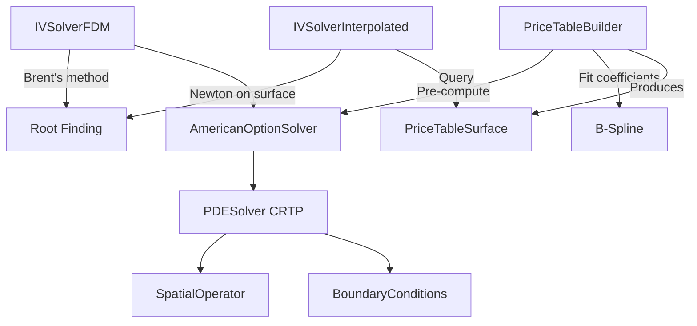

# Software Architecture

How the mango-option library is built, from the PDE solver core up through price tables and batch processing. Each section introduces the C++ patterns and design decisions where they arise, rather than cataloguing them separately.

**Related documents:**
- [Mathematical Foundations](MATHEMATICAL_FOUNDATIONS.md) — PDE formulations, numerical methods
- [API Guide](API_GUIDE.md) — Usage examples and recipes
- [Performance Analysis](PERF_ANALYSIS.md) — Instruction-level profiling data
- [USDT Tracing](TRACING.md) — Runtime observability

---

## Overview

The library has three computation paths, each targeting a different latency/accuracy tradeoff:

| Path | Latency | Use case |
|------|---------|----------|
| **FDM pricing** | ~1.4ms/option | Single option or small batch |
| **FDM-based IV** | ~19ms/IV | Ground-truth implied volatility |
| **Interpolated IV** | ~3.5us/IV | Production queries against pre-computed table |

All three paths share the same PDE solver core. The interpolated path adds a pre-computation step (building a 4D B-spline price table), then replaces the PDE solve at query time with a surface lookup plus Newton iteration.



The rest of this document walks through these components bottom-up: PDE solver core, American option layer, IV solvers, price tables, and finally batch processing.

---

## 1. PDE Solver Core

### CRTP for Zero-Cost Polymorphism

The PDE solver is a CRTP base class. Derived classes supply boundary conditions, a spatial operator, and optionally an obstacle function (for American options). The base class handles time-stepping, Newton iteration, and convergence control.

```cpp
template<typename Derived>
class PDESolver {
public:
    std::expected<void, SolverError> solve() {
        auto& derived = static_cast<Derived&>(*this);
        auto left_bc = derived.left_boundary();
        auto spatial_op = derived.spatial_operator();
        // TR-BDF2 time stepping with Newton iteration...
    }
};
```

Why CRTP instead of virtual functions? The solver's inner loop calls `spatial_operator().apply()` and `obstacle()` at every Newton iteration of every time step. Virtual dispatch would add ~5-10 cycles per call and prevent inlining. CRTP compiles to direct calls with full inlining, which matters when the loop body is only ~50 instructions. The tradeoff is more complex syntax and longer compile times.

A compile-time concept detects whether the derived class provides an analytical Jacobian:

```cpp
template<typename SpatialOp>
concept HasAnalyticalJacobian = requires(const SpatialOp op, double coeff_dt,
                                          TridiagonalMatrixView jac) {
    { op.assemble_jacobian(coeff_dt, jac) } -> std::same_as<void>;
};
```

If the concept is satisfied, the solver uses the analytical Jacobian directly. Otherwise it falls back to finite difference approximation. `BlackScholesPDE` provides an analytical Jacobian; custom PDEs do not need to.

### Grid and Workspace

The solver operates on two objects: a **Grid** (spatial coordinates and solution storage) and a **PDEWorkspace** (temporary buffers for the solve).

```
Grid (shared_ptr)                PDEWorkspace (owned by caller)
├── x coordinates                ├── dx (grid spacing)
├── u_current, u_prev            ├── Temporary buffers (u_stage, rhs, lu, psi)
├── Time domain                  └── Newton arrays (jacobian, residual, delta_u)
└── Snapshot storage
```

The Grid is shared-ownership (`std::shared_ptr`) because the result object needs the Grid for interpolation after the solver is destroyed. The workspace is caller-owned so it can be reused across multiple solves.

Grid generation uses a factory pattern with validation:

```cpp
auto spec = GridSpec<double>::sinh_spaced(-3.0, 3.0, 201, 2.0);
// Returns std::expected<GridSpec, std::string>
```

Three grid types: `uniform()`, `sinh_spaced()` (single concentration point), and `multi_sinh_spaced()` (multiple concentration points, useful for barrier options or multi-strike chains).

### Memory: PMR Arenas

All workspace arrays are allocated from a caller-provided PMR memory resource:

```cpp
std::pmr::synchronized_pool_resource pool;
auto workspace = PDEWorkspace::create(grid_spec, &pool).value();
```

This means zero allocation during the solve itself — all buffers are pre-allocated. For batch processing, the same pool serves multiple solves. The workspace totals ~13n doubles for a grid of n points (including Newton iteration arrays), padded to 8-element boundaries for AVX-512.

Why PMR instead of raw `new`? Repeated solves would otherwise allocate and deallocate the same ~10KB of buffers thousands of times. PMR lets the caller control lifetime: allocate once, reuse across solves, release when done. The tradeoff is that the caller must keep the memory resource alive.

### Spatial Operators and SIMD

Spatial operators (BlackScholesPDE, LaplacianPDE) compute `L*u` — the spatial discretization applied to the current solution vector. The inner loop is a weighted stencil:

```cpp
[[gnu::target_clones("default", "avx2", "avx512f")]]
void compute_second_derivative(...) {
    #pragma omp simd
    for (size_t i = start; i < end; ++i) {
        d2u_dx2[i] = weights[i].left  * u[i-1]
                   + weights[i].center * u[i]
                   + weights[i].right  * u[i+1];
    }
}
```

The `target_clones` attribute generates SSE2, AVX2, and AVX-512 versions. An IFUNC resolver picks the best one at first call (~500ns overhead, then zero). OpenMP SIMD pragmas guide auto-vectorization.

Why OpenMP SIMD instead of explicit SIMD intrinsics or `std::experimental::simd`? In benchmarks, OpenMP SIMD outperformed explicit SIMD in 9 of 12 cases (often by 15-45%). Modern compilers (GCC 14, Clang 19) are good enough at auto-vectorization that hand-written intrinsics add complexity without payoff for this workload.

The `CenteredDifference` class provides a unified facade for all derivative computations, delegating to a `ScalarBackend` that uses OpenMP SIMD internally. No runtime mode selection — the facade is thin enough for the compiler to inline through.

---

## 2. American Option Layer

### Solver and Result

`AmericanOptionSolver` derives from `PDESolver` and supplies:
- **Left boundary:** Dirichlet BC (intrinsic value for deep ITM)
- **Right boundary:** Dirichlet BC (zero for far OTM)
- **Spatial operator:** `BlackScholesPDE` with the option's vol, rate, and dividend yield
- **Obstacle:** Early exercise constraint (intrinsic value at each node)

The solver returns an `AmericanOptionResult` that wraps the Grid:

```cpp
class AmericanOptionResult {
    std::shared_ptr<const Grid<double>> grid_;
    PricingParams params_;

public:
    double price() const;   // Interpolate at spot
    double delta() const;   // dV/dS via CenteredDifference
    double gamma() const;   // d²V/dS²
    double theta() const;   // dV/dt via backward difference
};
```

Greeks are computed lazily on first access. Delta and gamma use centered finite differences on the spatial grid. Theta uses a backward difference between the last two time steps (stored as snapshots in the Grid).

### Error Handling with std::expected

All public APIs return `std::expected<T, Error>` instead of throwing. Validation chains compose monadically:

```cpp
auto validate_query(const IVQuery& query) const
    -> std::expected<std::monostate, IVError>
{
    return validate_positive_parameters(query)
        .and_then([&](auto) { return validate_arbitrage_bounds(query); })
        .and_then([&](auto) { return validate_grid_params(); });
}
```

Why not exceptions? The solver runs in tight loops (batch pricing, Brent iterations). Exception overhead — stack unwinding setup, code size bloat (~20-30%) — is disproportionate for a numerical library where errors are expected outcomes (e.g., convergence failure is not exceptional, it's a valid result). `std::expected` has zero cost on the success path and makes error handling explicit in the type system.

### Grid Auto-Estimation

`estimate_grid_for_option()` selects grid size and time steps based on volatility, maturity, and moneyness. A typical result is 101 spatial points and 498 time steps. This avoids requiring the user to understand numerical parameters while still allowing override for fine-grained control.

---

## 3. Implied Volatility Solvers

### FDM-Based (IVSolverFDM)

The FDM solver wraps Brent's root-finding method around the American option solver. Given a market price, it searches for the volatility that makes the model price match:

```
IVSolverFDM → Brent's method → AmericanOptionSolver (5-8 calls) → price
```

Each Brent iteration solves the PDE from scratch (no warm-starting), so total time is ~5-8 PDE solves. Adaptive volatility bounds narrow the search based on intrinsic value. Typical latency: ~19ms per IV on a 101x498 grid.

### Interpolated (IVSolverInterpolated)

The interpolated solver replaces the nested PDE solve with a lookup into a pre-computed 4D B-spline surface. Newton iteration on the smooth surface converges in 3-5 iterations, each requiring only a surface evaluation (~193ns). Total IV solve: ~3.5us — a 5,400x speedup over FDM.

This is the production path. You pay a one-time pre-computation cost (see next section), then amortize it over millions of queries.

---

## 4. Price Tables and B-Splines

### Pre-Computation Pipeline

`PriceTableBuilder` constructs a 4D price surface over (moneyness, maturity, volatility, rate). The pipeline:

1. Enumerate grid points across all four dimensions
2. For each (vol, rate) pair, solve the PDE across all maturities and strikes
3. Fit 4D tensor-product B-spline coefficients to the results
4. Package into a `PriceTableSurface` for fast evaluation

The tensor is stored as a `PriceTensor<4>` backed by an `AlignedVector` — a `std::vector` with a 64-byte aligned allocator. This alignment is needed for AVX-512 loads during B-spline evaluation.

Why `AlignedVector` instead of PMR? The price tensor is persistent output that outlives the solver. PMR only guarantees `alignof(max_align_t)` (16 bytes), but AVX-512 needs 64-byte alignment. The tensor is shared via `std::shared_ptr<AlignedVector<double>>`.

### Multi-Dimensional Indexing with mdspan

B-spline coefficients use `std::mdspan` for type-safe multi-dimensional indexing:

```cpp
mdspan<double, dextents<size_t, 4>> coeffs(data.data(), n_m, n_tau, n_sigma, n_r);
double c = coeffs[i, j, k, l];  // No manual stride calculation
```

This compiles to the same assembly as hand-rolled `data[i*s0 + j*s1 + k*s2 + l]` but eliminates index arithmetic errors.

### Grid Density Profiles

The builder supports automatic grid estimation via `from_chain_auto_profile()` with four density profiles (Low, Medium, High, Ultra). Grid budget is allocated by curvature:

| Dimension | Weight | Rationale |
|-----------|--------|-----------|
| Volatility (sigma) | 1.5x | Highest curvature from vega non-linearity |
| Moneyness (m) | 1.0x | ATM gamma peak handled by log-transform |
| Maturity (tau) | 1.0x | Baseline, sqrt-tau behavior |
| Rate (r) | 0.6x | Nearly linear discounting |

The default (High) targets ~20 bps average IV error. For tighter tolerance, `AdaptiveGridBuilder` iteratively refines grid density until a target error is met.

---

## 5. Batch Processing and Parallelism

### OpenMP Parallelization

Batch pricing parallelizes across options with OpenMP:

```cpp
MANGO_PRAGMA_PARALLEL
{
    ThreadWorkspaceBuffer buffer(required_bytes);
    auto ws = PDEWorkspace::from_bytes(buffer.bytes(), n).value();

    MANGO_PRAGMA_FOR_STATIC
    for (size_t i = 0; i < count; ++i) {
        solver.solve_with_workspace(params[i], ws);
    }
}
```

Each thread gets its own workspace, allocated once at thread creation. This reduces total allocations from O(work items) to O(thread count).

### ThreadWorkspaceBuffer

`ThreadWorkspaceBuffer` is not a workspace itself — it is a per-thread aligned byte slab (64-byte via `std::aligned_alloc`) that typed workspaces are constructed over. The relationship:

```
ThreadWorkspaceBuffer          (raw bytes, one per thread)
  └─► PDEWorkspace             (batch pricing — solver buffers)
  └─► BSplineCollocationWorkspace  (price table build — band matrix, pivots)
```

`PDEWorkspace` handles the PDE solver's arrays (solution vectors, Newton buffers, etc.). `BSplineCollocationWorkspace` handles B-spline fitting arrays (band matrix, LU workspace, pivot indices). Both are different typed views over the same kind of byte slab.

Why the indirection? In a parallel loop, each thread processes many work items. Without `ThreadWorkspaceBuffer`, every iteration would allocate and free its own workspace — thousands of times for batch pricing, 24,000+ times for B-spline fitting during price table construction. With it, each thread allocates one byte slab at thread creation, constructs the appropriate typed workspace over it, and reuses that workspace for every work item assigned to the thread. Total allocations drop from O(work items) to O(thread count).

The typed workspace is created via `from_bytes()`, which uses C++23's `std::start_lifetime_as_array` for strict-aliasing compliance. If the buffer is too small (shouldn't happen in normal use), it falls back to a PMR `unsynchronized_pool_resource`.

### Shared-Grid Optimization

When pricing a chain of options that differ only in strike (same vol, rate, maturity), the solver can share a single grid. This avoids re-generating spatial coordinates and re-computing grid-dependent quantities, giving ~10x speedup for a 15-option chain.

---

## Summary of C++23 Features

For reference, here are the C++23 features used and where they appear:

| Feature | Where | Purpose |
|---------|-------|---------|
| `std::expected<T, E>` | All public APIs | Type-safe error handling without exceptions |
| Concepts | PDESolver | Compile-time detection of analytical Jacobian |
| `std::mdspan` | B-spline coefficients | Type-safe multi-dimensional indexing |
| `std::start_lifetime_as_array` | ThreadWorkspaceBuffer | Strict-aliasing compliance for byte-buffer reuse |
| PMR (`std::pmr::vector`) | PDEWorkspace | Arena allocation for solver buffers |
| CRTP | PDESolver | Zero-cost polymorphism for spatial operators |
| `[[gnu::target_clones]]` | CenteredDifference | Multi-ISA code generation (SSE2/AVX2/AVX-512) |
| Designated initializers | Option params, grid specs | Readable struct construction |

---

## Related Documents

- [Mathematical Foundations](MATHEMATICAL_FOUNDATIONS.md) — PDE formulations and numerical methods
- [API Guide](API_GUIDE.md) — Usage examples and recipes
- [Performance Analysis](PERF_ANALYSIS.md) — Instruction-level profiling
- [Vectorization Strategy](architecture/vectorization-strategy.md) — SIMD benchmarks and rationale
- [USDT Tracing](TRACING.md) — Runtime observability
