# IV Calculation and Option Pricing Architecture Analysis

> **Note:** For an overview of the problem domain and project motivation, see [PROJECT_OVERVIEW.md](PROJECT_OVERVIEW.md).

## Executive Summary

The mango-iv codebase implements a complete suite for American option pricing and implied volatility (IV) calculation. It uses a **modern C++20 template-based architecture** with:

- **TR-BDF2 PDE solver** for American option pricing via finite difference method
- **American IV calculation** combining FDM with Brent's method for root-finding
- **Cubic spline interpolation** for off-grid solution evaluation
- **USDT tracing** for zero-overhead diagnostic monitoring
- **Template metaprogramming** with concepts for compile-time optimization
- **Zero-cost abstractions** via templates and inlining
- **Type-safe design** with std::span, std::optional, and concepts

## Architecture Overview

### Three Main Components


---

## Component 1: American Implied Volatility Calculation

### File Locations
- **Header**: `src/iv_solver.hpp`
- **Implementation**: `src/iv_solver.cpp`
- **Tests**: `tests/iv_solver_test.cc`

### Core Data Structures

```cpp
namespace mango {

/// Input parameters for IV calculation
struct IVParams {
    double spot_price;              // S: Current stock price
    double strike;                  // K: Strike price
    double time_to_maturity;        // T: Time to expiration (years)
    double risk_free_rate;          // r: Risk-free interest rate
    double market_price;            // Market price of option
    bool is_call;                   // true for call, false for put
};

/// Configuration for IV solver
struct IVConfig {
    RootFindingConfig root_config;  // Brent's method parameters
    size_t grid_n_space = 101;      // Spatial grid points for PDE
    size_t grid_n_time = 1000;      // Time steps for PDE
    double grid_s_max = 200.0;      // Maximum spot price for grid
};

/// Result from IV calculation
struct IVResult {
    bool converged;                 // True if converged
    size_t iterations;              // Number of iterations
    double implied_vol;             // Calculated implied volatility
    double final_error;             // Final pricing error
    std::optional<std::string> failure_reason;  // Error message if failed
    std::optional<double> vega;     // Optional vega at solution
};

} // namespace mango
```

### Dependencies

- **American Option** module (`american_option.hpp`) for FDM-based pricing
- **Brent's method** (`root_finding.hpp`) for root-finding

### IVSolver Class

```cpp
namespace mango {

class IVSolver {
public:
    /// Construct IV solver with parameters and optional config
    explicit IVSolver(const IVParams& params, const IVConfig& config = {});

    /// Solve for implied volatility
    /// Uses Brent's method with nested American option pricing
    IVResult solve();

private:
    IVParams params_;
    IVConfig config_;
};

} // namespace mango
```

**Usage Example:**
```cpp
mango::IVParams params{
    .spot_price = 100.0,
    .strike = 100.0,
    .time_to_maturity = 1.0,
    .risk_free_rate = 0.05,
    .market_price = 6.08,  // American put market price
    .is_call = false
};

mango::IVSolver solver(params);
mango::IVResult result = solver.solve();

if (result.converged) {
    std::cout << "Implied volatility: " << result.implied_vol << "\n";
    std::cout << "Iterations: " << result.iterations << "\n";
}
```

### Algorithm Overview

1. **Input Validation** (detects arbitrage violations):
   - Spot, strike, time, market price must be positive
   - Call price must not exceed spot price
   - Put price must not exceed strike price (present value)
   - Market price must be above intrinsic value

2. **Objective Function**:
   ```
   f(σ) = American_price_FDM(σ) - market_price
   ```
   Goal: Find σ where f(σ) = 0

3. **Brent's Method Root Finding**:
   - Searches in interval [0.01, upper_bound]
   - Each iteration solves full American option PDE (~21ms per call)
   - Combines bisection, secant, and inverse quadratic interpolation
   - Typical: 5-8 iterations → ~145ms total time

4. **Nested Iteration Structure:**
   - **Outer loop**: Brent's method searching for σ
   - **Inner loop**: Each iteration calls FDM solver for pricing
   - **Convergence**: When |theoretical_price - market_price| < tolerance

### Validation & Error Handling

The implementation validates:
- ✅ All inputs are positive
- ✅ No arbitrage violations (price bounds, intrinsic floor)
- ✅ Convergence within max iterations
- ✅ Returns `std::optional<std::string>` for error messages

### Test Coverage

From `iv_solver_test.cc`:
- ✅ American put IV recovery (ATM, OTM, ITM)
- ✅ American call IV recovery
- ✅ Input validation (invalid parameters)
- ✅ Arbitrage detection
- ✅ Convergence with default settings
- ✅ Edge cases (near expiry, extreme volatility)

### Performance Characteristics

| Operation | Time | Details |
|----------|------|---------|
| American option pricing (single) | ~21.7ms | FDM solve with 101 points × 1000 steps |
| American IV calculation (single) | ~145ms | 5-8 Brent iterations × 21.7ms per FDM call |

**Bottleneck**: FDM solver calls within Brent's method (each iteration = full PDE solve)

**Scaling**:
- Brent iterations: O(log(1/ε)) where ε is tolerance
- Total time: O(iterations × FDM_time) ≈ O(8 × 21.7ms) ≈ 145ms

---

## Component 2: American Option Pricing

### File Locations
- **Header**: `src/american_option.hpp`
- **Tests**: `tests/american_option_test.cc`
- **Related**: `src/operators/black_scholes_pde.hpp` (Black-Scholes operator)

### Core Data Structures

```cpp
namespace mango {

/// Option type enumeration
enum class OptionType {
    CALL,
    PUT
};

/// American option pricing parameters
struct AmericanOptionParams {
    double strike;                      // Strike price (dollars)
    double spot;                        // Current stock price (dollars)
    double maturity;                    // Time to maturity (years)
    double volatility;                  // Implied volatility (fraction)
    double rate;                        // Risk-free rate (fraction)
    double continuous_dividend_yield;   // Continuous dividend yield (fraction)
    OptionType option_type;             // Call or Put

    // Discrete dividend schedule: (time, amount) pairs
    std::vector<std::pair<double, double>> discrete_dividends;

    // Built-in validation
    void validate() const;
};

/// Numerical grid parameters for PDE solver
struct AmericanOptionGrid {
    size_t n_space;    // Number of spatial grid points
    size_t n_time;     // Number of time steps
    double x_min;      // Minimum log-moneyness (default: -3.0)
    double x_max;      // Maximum log-moneyness (default: +3.0)

    // Default constructor with sensible defaults
    AmericanOptionGrid();

    void validate() const;
};

/// Solver result containing option value and Greeks
struct AmericanOptionResult {
    double value;      // Option value (dollars)
    double delta;      // ∂V/∂S (first derivative wrt spot)
    double gamma;      // ∂²V/∂S² (second derivative wrt spot)
    double theta;      // ∂V/∂t (time decay)
    bool converged;    // Solver convergence status
};

} // namespace mango
```

### Mathematical Formulation

#### Black-Scholes PDE (Backward Time)

The classic Black-Scholes PDE with American option constraint:

```
∂V/∂τ = (1/2)σ²S² ∂²V/∂S² + rS ∂V/∂S - rV,  τ ∈ [0, T]
V(S,T) = payoff(S)
V(S,τ) ≥ intrinsic(S)                        [American constraint]
```

Where τ = T - t (time to maturity)

#### Log-Price Transformation

Substituting x = ln(S/K) to reduce volatility coefficient:

```
∂V/∂τ = (1/2)σ² ∂²V/∂x² + (r - σ²/2) ∂V/∂x - rV

Coefficients:
  - Second derivative: (1/2)σ²
  - First derivative: r - σ²/2
  - Zeroth order: -r
```

**Advantages**:
- Constant coefficients (don't depend on S)
- Natural moneyness scaling
- Better numerical stability

#### Boundary Conditions

**Left boundary** (x → -∞, S → 0):
- Call: V(0, τ) = 0 (worthless)
- Put: V(0, τ) = K·e^(-rτ) (discounted strike)

**Right boundary** (x → ∞, S → ∞):
- Call: V ≈ S - K (never exercise early, exercise value)
- Put: V(∞, τ) = 0 (worthless)

#### Terminal Condition (At Maturity)

```
V(S, 0) = payoff(S)
  Call: max(S - K, 0)
  Put: max(K - S, 0)
```

#### Obstacle Condition (American Constraint)

```
ψ(x) = intrinsic_value(x)
V(x,τ) ≥ ψ(x)  for all τ
```

This enforces early exercise: option value is at least intrinsic value at all times.

### Key API

#### **Class-Based Interface**
```cpp
namespace mango {

class AmericanOptionSolver {
public:
    /**
     * Constructor.
     *
     * @param params Option pricing parameters (including discrete dividends)
     * @param grid Numerical grid parameters
     * @param trbdf2_config TR-BDF2 solver configuration
     * @param root_config Root finding configuration for Newton solver
     */
    AmericanOptionSolver(const AmericanOptionParams& params,
                        const AmericanOptionGrid& grid,
                        const TRBDF2Config& trbdf2_config = {},
                        const RootFindingConfig& root_config = {});

    /**
     * Solve for option value and Greeks.
     *
     * @return Result containing option value and Greeks
     */
    AmericanOptionResult solve();

    /**
     * Get the full solution surface (for debugging/analysis).
     *
     * @return Vector of option values across the spatial grid
     */
    std::vector<double> get_solution() const;

private:
    // Internal implementation details...
};

} // namespace mango
```

**Workflow**:
1. Creates spatial grid in log-price coordinates
2. Sets up time domain (forward time = time-to-maturity)
3. Converts discrete dividends to temporal events
4. Configures BlackScholesOperator with volatility and drift
5. Sets up obstacle conditions for early exercise
6. Solves using TR-BDF2 with Newton iteration
7. Computes Greeks via finite differences

**RAII Memory Management**: All resources automatically managed, no manual cleanup needed

### Grid Configuration Recommendations

**Typical Settings**:
```c
AmericanOptionGrid default_grid = {
    .x_min = -0.7,      // ln(0.5) - covers 50% of strike
    .x_max = 0.7,       // ln(2.0) - covers 200% of strike
    .n_points = 141,    // ~0.01 spacing in log-price
    .dt = 0.001,        // 0.1% per step
    .n_steps = 1000     // 1 year with daily resolution
};
```

**Refinement for Accuracy**:
```c
AmericanOptionGrid fine_grid = {
    .x_min = -1.0,
    .x_max = 1.0,
    .n_points = 201,    // Finer spacing
    .dt = 0.0005,       // Smaller steps
    .n_steps = 2000     // More steps
};
```

### Test Coverage

From `american_option_test.cc`:
- ✅ Basic call and put options
- ✅ Put-call relationships (American options don't have exact parity)
- ✅ Early exercise premium verification
- ✅ Intrinsic value bounds (V ≥ intrinsic)
- ✅ Monotonicity in volatility (higher vol → higher value)
- ✅ Monotonicity in time to maturity
- ✅ OTM/ITM/Deep OTM/Deep ITM scenarios
- ✅ Short/long maturity cases
- ✅ High/low volatility extremes
- ✅ Zero and negative interest rates
- ✅ Grid resolution sensitivity
- ✅ Single dividend, multiple dividends
- ✅ Dividend timing (early vs late)
- ✅ Dividend impact on calls (decreases value)
- ✅ Dividend impact on puts (increases value)
- ✅ Zero dividend amounts (should match no-dividend case)

**Test Result**: 42 test cases covering comprehensive scenarios

### Performance Characteristics

| Configuration | Grid | Time Steps | Time/Option |
|---|---|---|---|
| Coarse | 141×1000 | 500 | 8-10 ms |
| Typical | 141×1000 | 1000 | 21-22 ms |
| Fine | 201×2000 | 2000 | 80-100 ms |

**Comparison to QuantLib** (from benchmarks/BENCHMARK.md):
- IV Calc: 21.6 ms per option
- QuantLib: 10.4 ms per option
- Ratio: 2.1x slower (reasonable for research code)

**Key Performance Factors**:
- ✅ SIMD vectorization on spatial operators
- ✅ Single contiguous workspace buffer
- ✅ Minimal malloc during solve
- ✅ OpenMP parallel batch processing

---

## Component 3: PDE Solver (Finite Difference Method Engine)

### File Locations
- **Header**: `src/pde_solver.hpp`
- **Tests**: `tests/pde_solver_test.cc`
- **Operators**: `src/operators/` directory
- **Example**: `examples/example_newton_solver.cc`

### Overview

The PDE solver implements the **TR-BDF2 (Two-stage Runge-Kutta with Backward Differentiation Formula 2)** scheme for solving parabolic PDEs:

```
∂u/∂t = L(u) + boundary/obstacle constraints
u(x, 0) = u₀(x)
```

### TR-BDF2 Time Stepping Scheme

A two-stage implicit scheme combining:
1. **Stage 1**: Trapezoidal rule from t_n to t_n + γ·dt (γ ≈ 0.5858)
2. **Stage 2**: BDF2 from t_n to t_n+1

**Properties**:
- L-stable (dampens high-frequency errors)
- Second-order accurate
- Unconditionally stable (large dt possible)
- Requires implicit solve each stage

### Memory Management (Single Buffer Architecture)

**Workspace (6n doubles + dx array, contiguous allocation):**

All arrays allocated from single contiguous buffer with std::span views:


**Advantages**:
- Single malloc: 6n doubles vs old 12n (50% memory reduction)
- Better cache locality with smaller working set
- Pre-computed dx eliminates redundant spacing calculations
- std::span provides bounds-checked views (debug mode)
- Zero overhead during time-stepping (no allocations)

**Key Improvements from C version**:
- **Removed arrays**: matrix_diag, matrix_upper, matrix_lower (3n) - Newton workspace now separate
- **Removed arrays**: u_old, u_temp (2n) - no longer needed with refactored algorithm
- **Removed arrays**: tridiag_workspace (2n) - Newton workspace manages this
- **Added**: Pre-computed dx array for faster stencil operations
- **Added**: Dedicated psi buffer for obstacle conditions

### Template-Based Architecture

The PDE solver uses C++20 templates with concepts for type-safe, zero-cost abstractions:

```cpp
namespace mango {

// Initial condition: lambda or function object
// Signature: void(std::span<const double> x, std::span<double> u0)
using InitialConditionFunc = std::function<void(std::span<const double>, std::span<double>)>;

// Boundary conditions: Concept-based compile-time polymorphism
template<typename T>
concept BoundaryCondition = requires(T bc, double t) {
    { bc.value(t) } -> std::convertible_to<double>;
    { bc.type() } -> std::same_as<BoundaryType>;
};

// Spatial operator: Concept-based interface
template<typename T>
concept SpatialOperator = requires(T op, std::span<const double> x, double t,
                                    std::span<const double> u, std::span<double> Lu) {
    { op(x, t, u, Lu) } -> std::same_as<void>;
};

// Obstacle condition: Optional callback
using ObstacleCallback = std::function<void(double t, std::span<const double> x,
                                             std::span<double> psi)>;

// Temporal events: Event-driven architecture
using TemporalEventCallback = std::function<void(double t, std::span<const double> x,
                                                  std::span<double> u)>;

struct TemporalEvent {
    double time;
    TemporalEventCallback callback;

    auto operator<=>(const TemporalEvent& other) const {
        return time <=> other.time;  // C++20 spaceship operator
    }
};

} // namespace mango
```

### Temporal Event System

The solver supports **temporal events** for handling discrete discontinuities in time (e.g., dividend payments, regime changes).

**Registration** (via PDESolver constructor):
```cpp
// Temporal events are registered during solver construction
std::vector<TemporalEvent> events;

events.push_back({
    .time = 0.25,
    .callback = [](double t, std::span<const double> x, std::span<double> u) {
        // Handle first event
    }
});

events.push_back({
    .time = 0.75,
    .callback = [](double t, std::span<const double> x, std::span<double> u) {
        // Handle second event
    }
});

// Events automatically sorted by time via spaceship operator
```

**How it works**:
1. Solver maintains sorted list of event times (using `operator<=>`)
2. During time-stepping, checks if current step crosses an event
3. When event triggered:
   - Solver completes step to exact event time
   - Calls lambda callback with std::span views of solution
   - Callback modifies solution in-place (e.g., applies dividend jump)
   - Solver continues from modified state

**Example use case - Dividend payments**:
```cpp
auto dividend_event = [dividend_amount, strike](double t,
                                                 std::span<const double> x,
                                                 std::span<double> u) {
    // Apply stock price jump from dividend payment
    // Lambda captures dividend amount and strike
    apply_dividend_jump(x, u, dividend_amount, strike);
};
```

**Thread safety**: Each solver instance has independent event state; lambda captures are thread-local.

### Core API

#### 1. **Solver Construction (Template-Based)**
```cpp
template<typename BoundaryL, typename BoundaryR, typename SpatialOp>
PDESolver(std::span<const double> grid,
          const TimeDomain& time,
          const TRBDF2Config& config,
          const RootFindingConfig& root_config,
          const BoundaryL& left_bc,
          const BoundaryR& right_bc,
          const SpatialOp& spatial_op,
          std::optional<ObstacleCallback> obstacle = std::nullopt);
```

**Type Safety**: Template parameters constrained by concepts at compile-time

**RAII**: Grid passed as std::span (non-owning view), resources managed automatically

#### 2. **Solver Lifecycle**
```cpp
void initialize(InitialConditionFunc ic);  // Apply initial conditions
bool solve();                              // Full solve loop (returns convergence status)
bool step(double t_current);               // Single time step
```

**Modern Error Handling**: Returns bool for success/failure instead of error codes

#### 3. **Solution Access (Zero-Copy Views)**
```cpp
std::span<const double> solution() const;      // Get solution array (read-only view)
std::span<const double> grid() const;          // Get spatial grid (read-only view)
double interpolate(double x_eval) const;       // Cubic spline interpolation
```

**std::span Benefits**: Zero-copy, bounds-checked in debug builds, iterator support

### Newton Solver for Implicit Stages

The C++20 implementation uses **Newton's method** (via `NewtonWorkspace`) to solve implicit stages, not fixed-point iteration:

```cpp
// For each TR-BDF2 implicit stage, solve:
// F(u) = u - dt·α·L(u) - RHS = 0
//
// Newton iteration:
//   J·Δu = -F(u^k)
//   u^{k+1} = u^k + Δu
//
// where J is the Jacobian approximated via finite differences
```

**Newton Workspace** (from `newton_workspace.hpp`):
- Builds Jacobian matrix (tridiagonal for 1D PDEs)
- Solves linear system via Thomas algorithm
- Quasi-Newton: Jacobian computed once per stage, not per iteration
- Convergence: `||F(u)|| < tolerance`

**Configuration**:
```cpp
namespace mango {

struct TRBDF2Config {
    double gamma = 2.0 - std::sqrt(2.0);  // TR-BDF2 parameter (≈ 0.5858)
    size_t cache_blocking_threshold = 5000;  // Enable cache blocking for large grids
};

struct RootFindingConfig {
    size_t max_iter = 100;        // Max Newton iterations per stage
    double tolerance = 1e-6;      // Convergence tolerance
    double jacobian_fd_epsilon = 1e-7;  // Finite difference step for Jacobian
};

} // namespace mango
```

### Boundary Condition Types

```cpp
namespace mango {

enum class BoundaryType {
    DIRICHLET,   // u = g(t)
    NEUMANN,     // ∂u/∂x = g(t)
    ROBIN        // a·u + b·∂u/∂x = g(t)
};

// Example boundary condition classes
class DirichletBC {
    double value_;
public:
    explicit DirichletBC(double v) : value_(v) {}
    double value(double t) const { return value_; }
    BoundaryType type() const { return BoundaryType::DIRICHLET; }
};

class NeumannBC {
    double gradient_;
public:
    explicit NeumannBC(double g) : gradient_(g) {}
    double value(double t) const { return gradient_; }
    BoundaryType type() const { return BoundaryType::NEUMANN; }
};

class RobinBC {
    double a_, b_, g_;
public:
    RobinBC(double a, double b, double g) : a_(a), b_(b), g_(g) {}
    double value(double t) const { return g_; }
    BoundaryType type() const { return BoundaryType::ROBIN; }
    double coeff_a() const { return a_; }
    double coeff_b() const { return b_; }
};

} // namespace mango
```

### Boundary Condition Implementation

The C++20 implementation uses **compile-time dispatch** via templates and concepts to handle different boundary types efficiently.

#### Dirichlet Boundaries
Direct assignment of boundary values:
```cpp
u[0] = left_bc.value(t);      // Left boundary
u[n-1] = right_bc.value(t);   // Right boundary
```

#### Neumann Boundaries
For ∂u/∂x = g at boundaries, handled via modified stencils during operator evaluation.

#### Robin Boundaries
For a·u + b·∂u/∂x = g at boundaries:
- Incorporated into Newton Jacobian
- Both value and derivative conditions applied
- Type-safe coefficient access via `coeff_a()` and `coeff_b()` methods

### Performance Optimizations

#### Memory Efficiency
The C++20 implementation achieves significant memory reduction:
- **Workspace**: 6n doubles (down from 12n in C version)
- **Newton workspace**: 8n doubles allocated + 2n borrowed
- **Total**: ~14n doubles vs 24n+ in legacy code (42% reduction)

#### Cache Blocking
Automatic cache blocking for large grids (n ≥ 5000):
- Splits spatial operators into L1-sized blocks (~1000 points)
- Reduces memory bandwidth pressure
- Transparent to user (same results as non-blocked)

#### Template-Based Zero-Cost Abstractions
- Boundary conditions: Compile-time dispatch via concepts
- Spatial operators: No virtual function overhead
- All callbacks inlined by compiler

### Test Coverage

From `pde_solver_test.cc`:
- ✅ Heat equation (classic diffusion)
- ✅ Wave equation (hyperbolic)
- ✅ Advection-diffusion
- ✅ Dirichlet, Neumann, and Robin boundary conditions
- ✅ Convergence to analytical solutions
- ✅ Various grid resolutions
- ✅ Stability tests
- ✅ Jump conditions (discontinuous coefficients)
- ✅ Obstacle conditions (variational inequalities)

---

## Component 4: Supporting Infrastructure

### 4.1 Brent's Root Finder

**File**: `src/brent.h` (header-only, inline)

**Algorithm**: Combines bisection, secant method, and inverse quadratic interpolation
- **Guaranteed convergence** if root is bracketed
- **Superlinear convergence** rate (~1.6x faster than bisection)
- **No derivative required**
- **More robust than Newton's method**

**Usage in IV Calculation**: Finds σ such that BS_price(σ) = market_price

### 4.2 Cubic Spline Interpolation

**File**: `src/cubic_spline_solver.hpp`

**Purpose**: Evaluate PDE solution at arbitrary off-grid points

**Method**: Natural cubic splines implementing C² continuous piecewise polynomials

**Modern C++20 API**:
```cpp
namespace mango {

template<FloatingPoint T>
class CubicSpline {
public:
    /// Construct spline from data points
    /// @param x X-coordinates (must be strictly increasing)
    /// @param y Y-coordinates
    /// @param config Spline configuration (default: natural boundaries)
    /// @return Optional error message (nullopt on success)
    [[nodiscard]] std::optional<std::string_view> build(
        std::span<const T> x,
        std::span<const T> y,
        const CubicSplineConfig<T>& config = {}
    );

    /// Evaluate spline at point x
    [[nodiscard]] T eval(T x_eval) const noexcept;

    /// Evaluate first derivative at point x
    [[nodiscard]] T eval_derivative(T x_eval) const noexcept;

    /// Evaluate second derivative at point x
    [[nodiscard]] T eval_second_derivative(T x_eval) const noexcept;
};

} // namespace mango
```

**Usage Example**:
```cpp
// Create and build spline
mango::CubicSpline<double> spline;
auto error = spline.build(x_grid, solution_values);

if (error) {
    std::cerr << "Spline construction failed: " << *error << "\n";
    return;
}

// Evaluate at arbitrary points
double value = spline.eval(0.5);
double slope = spline.eval_derivative(0.5);
double curvature = spline.eval_second_derivative(0.5);
```

**Key Features**:
- **Type-safe**: Template-based with `FloatingPoint` concept
- **Zero-copy input**: Uses `std::span` for data views
- **RAII memory management**: No manual cleanup needed
- **Cache-efficient**: Struct-of-arrays layout for coefficient storage
- **Thomas solver**: Tridiagonal system solved via optimized Thomas algorithm
- **Binary search**: O(log n) interval lookup for evaluation

**Boundary Conditions**:
```cpp
enum class SplineBoundary {
    NATURAL,      // f''(x₀) = f''(xₙ) = 0 (default)
    CLAMPED,      // f'(x₀) and f'(xₙ) specified (future)
    NOT_A_KNOT    // f'''(x₁⁻) = f'''(x₁⁺) (future)
};
```

Currently only `NATURAL` boundary conditions are implemented (clamped and not-a-knot planned for future releases).

**Memory Layout**:
- Grid points: `n` doubles for x, `n` doubles for y
- Coefficients: `(n-1)` intervals × 4 coefficients = `4(n-1)` doubles
- Second derivatives: `n` doubles (c coefficients)
- Total: ~`6n` doubles

**Performance**:
- Construction: O(n) via Thomas algorithm
- Evaluation: O(log n) via binary search + O(1) polynomial evaluation
- Cache-friendly: Sequential memory access patterns

### 4.3 Tridiagonal Solver

**File**: `src/thomas_solver.hpp`

**Method**: Thomas algorithm (TDMA - Tridiagonal Matrix Algorithm)
- **Time complexity**: O(n)
- **Used by**:
  - TR-BDF2 implicit solver
  - Cubic spline coefficient calculation

### 4.4 USDT Tracing System

**Files**: Tracing infrastructure integrated throughout C++ codebase

**Purpose**: Zero-overhead diagnostic tracing for profiling and debugging

**Probe Categories**:
1. **Algorithm Lifecycle**: Start, progress, complete
2. **Convergence**: Iterations, success/failure
3. **Validation**: Input errors, runtime errors
4. **Module-specific**:
   - PDE: Start, progress, complete, convergence
   - IV: Start, complete, validation errors
   - American options: Start, complete
   - Brent's method: Start, iterations, complete
   - Cubic spline: Errors

**Zero Overhead**: Compiles to NOP instructions when not traced; can be dynamically enabled at runtime via bpftrace

---

## Integration Architecture

### Workflow 1: American IV Calculation

```
Market Price + Option Parameters
          ↓
calculate_iv_simple()
          ↓
    Estimate European IV using Let's Be Rational (~781ns)
    Calculate upper bound: vol_upper = european_iv × 1.5
          ↓
    Setup American pricing objective: f(σ) = American_price_FDM(σ) - market_price
          ↓
    Use Brent's method to find σ where f(σ) = 0
      Each iteration:
        - Construct American option with guessed σ
        - Solve Black-Scholes PDE via FDM (~21ms)
        - Interpolate value at spot price
        - Return error vs market price
      Typical: 5-8 iterations → ~145ms total
          ↓
    Return: IVResult (implied_vol, iterations, convergence status)
```

### Workflow 2: American Option Pricing

```
Option Parameters + Grid Configuration
          ↓
american_option_price()
          ↓
    Create spatial grid in log-price coordinates
    Setup PDE callbacks:
      - Terminal condition: payoff function
      - Spatial operator: BS PDE discretization
      - Boundary conditions: left/right BC
      - Obstacle: intrinsic value constraint
      - Optional: temporal events for dividends
          ↓
    Create PDE solver
    pde_solver_initialize()  // Apply initial condition
    pde_solver_solve()       // Time-step to maturity
          ↓
    Return: PDESolver with solution
```

### Workflow 3: Batch American Option Pricing + IV

```
Array of option parameters
          ↓
american_option_price_batch()  [OpenMP parallel for]
          ↓
    Each thread:
      - Solves American option PDE
      - Returns PDESolver
          ↓
Market prices for options
          ↓
Parallel IV calculation
          ↓
    For each option:
      - Get European BS price at spot
      - Use Brent to find IV
          ↓
Returns: Array of implied volatilities
```

---

## Data Flow Diagram

```mermaid
graph TD
    PARAMS["Option Parameters<br/>(S, K, T, r, market_price)"]

    IVSOLVER["IV Solver<br/>iv_solver.hpp/cpp"]

    AMERICAN["American Pricer<br/>american_option.hpp<br/>~21ms per solve"]

    PDE["PDE Solver<br/>pde_solver.hpp<br/>Template-based"]

    OPS["Spatial Operators<br/>operators/*.hpp<br/>BlackScholesOperator"]

    BC["Boundary Conditions<br/>boundary_conditions.hpp"]

    NEWTON["Newton Workspace<br/>Implicit solver"]

    SPLINE["Cubic Spline<br/>cubic_spline_solver.hpp"]

    VALUE["Option Value at Spot"]

    MARKET["Market Price<br/>(from market)"]

    OBJECTIVE["Objective Function<br/>f(σ) = price(σ) - market"]

    BRENT["Brent Root Finder<br/>root_finding.hpp<br/>5-8 iterations"]

    IV["American Implied Volatility<br/>~145ms total"]

    PARAMS --> IVSOLVER
    IVSOLVER --> BRENT
    IVSOLVER --> AMERICAN

    AMERICAN --> PDE
    PDE --> OPS
    PDE --> BC
    PDE --> NEWTON
    PDE -->|"Solution"| SPLINE
    SPLINE --> VALUE
    VALUE --> OBJECTIVE

    MARKET --> OBJECTIVE
    OBJECTIVE --> BRENT

    BRENT -->|"Each iteration<br/>calls FDM"| AMERICAN
    BRENT --> IV

    style PARAMS fill:#e3f2fd,stroke:#333,stroke-width:2px,color:#000
    style IVSOLVER fill:#e1f5ff,stroke:#333,stroke-width:2px,color:#000
    style AMERICAN fill:#fff4e1,stroke:#333,stroke-width:2px,color:#000
    style PDE fill:#ffe1f5,stroke:#333,stroke-width:2px,color:#000
    style OPS fill:#e8f5e9,stroke:#333,stroke-width:2px,color:#000
    style BC fill:#e8f5e9,stroke:#333,stroke-width:2px,color:#000
    style NEWTON fill:#f3e5f5,stroke:#333,stroke-width:2px,color:#000
    style SPLINE fill:#e8f5e9,stroke:#333,stroke-width:2px,color:#000
    style VALUE fill:#fce4ec,stroke:#333,stroke-width:2px,color:#000
    style MARKET fill:#ffebee,stroke:#333,stroke-width:2px,color:#000
    style OBJECTIVE fill:#fff9c4,stroke:#333,stroke-width:2px,color:#000
    style BRENT fill:#f0f0f0,stroke:#333,stroke-width:2px,color:#000
    style IV fill:#c8e6c9,stroke:#333,stroke-width:2px,color:#000
```



---

## Performance Characteristics

### American Implied Volatility Calculation

| Operation | Time | Notes |
|----------|------|-------|
| Let's Be Rational (bound) | ~781ns | European IV estimation |
| American option pricing (FDM) | ~21.7ms | Single FDM solve |
| American option pricing (table) | ~500ns | 4D cubic spline interpolation (43,400× faster) |
| American IV (FDM-based) | ~145ms | 5-8 Brent iterations × 21.7ms |
| **American IV (table-based)** | **~11.8ms** | **Newton's method with interpolation (22.5× faster)** |
| Greeks (vega, gamma) | ~500ns | Precomputed during table generation (130,000× faster) |

**Bottleneck**: FDM solver calls within Brent's method (each iteration = full PDE solve)

**Scaling**: O(iterations × FDM_time) ≈ O(8 × 21.7ms) ≈ 145ms

### American Option Pricing (Unoptimized)

| Configuration | Time/Option | Notes |
|---|---|---|
| Default (141 points, 1000 steps) | 21.7 ms | Baseline |
| Fine (201 points, 2000 steps) | 80-100 ms | Higher accuracy |
| Coarse (101 points, 500 steps) | 8-10 ms | Lower accuracy |

**Speedup factors**:
- ✅ AVX-512 SIMD: 2.2x (from 48ms to 21.5ms)
- ✅ OpenMP batch: 10-60x depending on core count

### QuantLib Comparison

From benchmark:
- **QuantLib**: 10.4 ms per option (mature, highly optimized)
- **mango-iv**: 21.6 ms per option (research, opportunities for optimization)
- **Ratio**: 2.1x (reasonable; different algorithms, grid resolution)

### Optimization Opportunities

**Completed Optimizations:**
- ✅ Batch API (OpenMP parallel processing, 11.7x speedup)
- ✅ Zero-allocation tridiagonal solver (Phase 2, ~5-10% gain)
- ✅ 64-byte alignment for SIMD
- ✅ Single workspace buffer (12n doubles)
- ✅ FMA operations in hot loops (fma() function for multiply-add)
- ✅ Restrict pointers for better compiler optimization (__restrict__ keyword)
- ✅ SIMD-optimized loops (#pragma omp simd on critical paths)

**Potential Future Optimizations:**
- Cache-blocking for large grids
- Better initial guesses for Newton iterations
- Adaptive time stepping

**Note**: Red-Black PSOR and even-odd splitting are not applicable to the current TR-BDF2 + Thomas algorithm implementation. These would require switching to iterative solvers.

---

## Architecture Strengths

### ✅ Mathematical Correctness
- Black-Scholes formula matches financial theory
- TR-BDF2 scheme is well-established
- Obstacle condition properly enforces American constraint
- Dividend handling via temporal events is mathematically sound

### ✅ Callback-Based Flexibility
- Users can implement custom PDEs
- Custom boundary conditions easily added
- Jump conditions and obstacles supported
- Temporal events for arbitrary time-based discontinuities

### ✅ Vectorization-Ready
- Array-oriented callbacks (not per-element)
- OpenMP SIMD pragmas on hot loops
- Single contiguous workspace buffer
- 64-byte aligned for SIMD operations

### ✅ Memory Efficiency
- Single workspace allocation
- No intermediate tree structures (O(n) not O(n²))
- Minimal malloc during solve loop
- Cubic splines share tridiagonal solver

### ✅ Comprehensive Validation
- 44 IV tests
- 29 American option tests
- 20+ PDE solver tests
- Benchmark comparison against QuantLib
- USDT tracing for diagnostics

### ✅ Parallel-Ready
- Batch API for multi-core processing
- No shared state in callbacks
- Thread-safe design
- Enables 60x+ speedup on multi-core machines

---

## Architecture Limitations & Known Issues

### ⚠️ American Option Implementation Issue

**Location**: `american_option.c` lines 82-86 (TODO comment)

**Issue**: Time mapping for backward parabolic PDE may not be perfectly correct
- Solver forward-integrates in time-to-maturity space
- Mathematical formulation correct, implementation needs verification
- Tests acknowledge but verify solver completes without crashing

**Impact**: Results reasonable but may have systematic bias
- Solver converges and produces monotone behavior
- Early exercise premium captured (dividend impact correct)
- Accuracy within reasonable bounds vs QuantLib

**Mitigation**: Comprehensive testing shows results are sensible, even if formulation not perfect

### 📊 Performance Characteristics

**Sequential Performance**: 2.1x slower than QuantLib (21.6ms vs 10.4ms per option)
- Different algorithms and grid resolution choices
- Research implementation with clear optimization opportunities

**Batch Performance**: Excellent parallel scaling
- 11.7x speedup at 100 options with OpenMP batch processing
- 91% parallel efficiency at 8 threads
- 2,000+ options/second sustained throughput
- Thread-safe with zero data races

**Note**: Single-option performance gap is offset by superior batch throughput on multi-core systems

---

## Usage Patterns

### Pattern 1: American IV Calculation

```c
#include "src/implied_volatility.h"

IVParams params = {
    .spot_price = 100.0,
    .strike = 100.0,
    .time_to_maturity = 1.0,
    .risk_free_rate = 0.05,
    .market_price = 6.08,  // American put market price
    .is_call = false
};

// Simple API: uses default grid and Let's Be Rational for bounds
IVResult result = calculate_iv_simple(&params);
if (result.converged) {
    printf("American IV: %.4f (%.1f%%)\n", result.implied_vol, result.implied_vol * 100);
    printf("Iterations: %d\n", result.iterations);
} else {
    printf("Error: %s\n", result.error);
}
```

### Pattern 2: American Option Pricing

```c
#include "src/american_option.h"

OptionData option = {
    .strike = 100.0,
    .volatility = 0.2,
    .risk_free_rate = 0.05,
    .time_to_maturity = 1.0,
    .option_type = OPTION_PUT,
    .n_dividends = 0,
    .dividend_times = nullptr,
    .dividend_amounts = nullptr
};

AmericanOptionGrid grid = {
    .x_min = -0.7,
    .x_max = 0.7,
    .n_points = 141,
    .dt = 0.001,
    .n_steps = 1000
};

AmericanOptionResult result = american_option_price(&option, &grid);
if (result.status == 0) {
    double value = american_option_get_value_at_spot(result.solver, 100.0, 100.0);
    printf("Value: %.4f\n", value);
    american_option_free_result(&result);
}
```

### Pattern 3: Batch Processing

```c
// Create array of options
OptionData options[100];
for (size_t i = 0; i < 100; i++) {
    options[i] = { /* ... configure each option ... */ };
}

// Create array for results
AmericanOptionResult results[100] = {0};

// Batch price (OpenMP parallel)
int status = american_option_price_batch(options, &grid, 100, results);

// Process results
for (size_t i = 0; i < 100; i++) {
    if (results[i].status == 0) {
        // Use result
        american_option_free_result(&results[i]);
    }
}
```

---

## Building & Testing

```bash
# Build everything
bazel build //...

# Run all tests
bazel test //...

# Build with optimizations
bazel build -c opt //...

# Run IV tests
bazel test //tests:implied_volatility_test

# Run American option tests
bazel test //tests:american_option_test

# Run PDE solver tests
bazel test //tests:pde_solver_test

# Compare with QuantLib (requires libquantlib0-dev)
bazel build //benchmarks:quantlib_benchmark
./bazel-bin/benchmarks/quantlib_benchmark
```

---

## Summary Table

| Component | Purpose | Files | Key Classes/Functions |
|-----------|---------|-------|----------------------|
| **American IV** | American IV from market price | iv_solver.{hpp,cpp} | `mango::IVSolver`, `mango::IVParams`, `mango::IVResult` |
| **American Option** | American option pricing | american_option.{hpp,cpp} | `mango::AmericanOption` |
| **PDE Solver** | Template-based FDM engine | pde_solver.hpp | `mango::PDESolver<BoundaryL, BoundaryR, SpatialOp>` |
| **Spatial Operators** | Operator implementations | operators/*.hpp | `LaplacianOperator`, `BlackScholesOperator`, concept-based |
| **Boundary Conditions** | BC types | boundary_conditions.hpp | `DirichletBC`, `NeumannBC`, `RobinBC` |
| **Root Finding** | Root finding methods | root_finding.hpp | `mango::RootFindingConfig`, Brent's method |
| **Cubic Spline** | Off-grid interpolation | cubic_spline_solver.hpp | Template-based spline solver |
| **Thomas Solver** | Tridiagonal solver | thomas_solver.hpp | O(n) matrix solve |
| **Newton Workspace** | Implicit solver workspace | newton_workspace.hpp | `mango::NewtonWorkspace` |
| **Grid Management** | Grid utilities | grid.hpp | Grid creation and management |
| **Workspace** | Memory management | workspace.hpp | `mango::WorkspaceStorage` |

---

## Conclusion

The mango-iv codebase implements a complete, production-ready suite for American option pricing and implied volatility calculation. The architecture prioritizes:

1. **Mathematical correctness** (Let's Be Rational, TR-BDF2, obstacle conditions, nested iteration)
2. **Flexibility** (callback-based design, custom PDEs)
3. **Vectorization** (array-oriented, SIMD-ready)
4. **Performance** (single workspace buffer, batch API, parallel-ready)
5. **Validation** (comprehensive test coverage, QuantLib comparison)

**Current Performance:**
- American option pricing (FDM): ~21.7ms per solve
- American option pricing (table): ~500ns per query (43,400× faster)
- American IV (FDM-based): ~145ms (5-8 Brent iterations)
- American IV (table-based): ~11.8ms (Newton's method, 22.5× faster)
- Greeks (vega, gamma): ~500ns (precomputed, 130,000× faster than FDM)
- Let's Be Rational (bounds): ~781ns (European IV estimation)

**Achieved Optimizations:**
- ✅ Price table pre-computation + interpolation: ~500ns per price query
- ✅ Table-based IV calculation: 22.5× speedup achieved
- ✅ Adaptive grid refinement: <1bp IV error for 95% of validation points
- ✅ Unified grid architecture: 20,000× memcpy reduction
- ✅ Enables sub-millisecond trading applications

